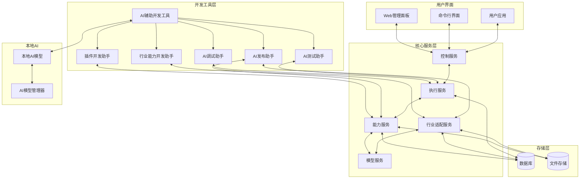

# 八爪鱼AI辅助开发工具设计文档

## 1. 概述

本文档详细描述八爪鱼（Octopus）AI智能体执行框架的AI辅助开发工具设计，包括本机AI辅助快速开发、调试、测试、发布插件和行业能力，以及支持最终用户通过UI自动使用这些功能的实现方案。

## 2. 设计目标

- **快速开发**：利用AI辅助开发者快速创建插件和行业能力
- **智能调试**：AI辅助识别和修复代码问题
- **自动化测试**：AI辅助生成测试用例和执行测试
- **简化发布**：AI辅助插件和行业能力的发布流程
- **用户友好**：支持最终用户通过UI自动使用插件和行业能力
- **本机集成**：支持本地AI模型，无需依赖云服务

## 3. 系统架构

### 3.1 整体架构

### 3.2 核心组件

| 组件 | 描述 | 功能 |
|------|------|------|
| **AI辅助开发工具** | 核心开发工具 | 整合所有AI辅助功能 |
| **插件开发助手** | 插件开发支持 | 辅助创建和管理插件 |
| **行业能力开发助手** | 行业能力开发支持 | 辅助创建和管理行业能力 |
| **AI调试助手** | 调试支持 | 辅助识别和修复代码问题 |
| **AI测试助手** | 测试支持 | 辅助生成测试用例和执行测试 |
| **AI发布助手** | 发布支持 | 辅助插件和行业能力的发布流程 |
| **本地AI模型** | 本地AI能力 | 提供本地AI推理能力 |
| **AI模型管理器** | AI模型管理 | 管理本地和远程AI模型 |

## 4. 功能设计

### 4.1 本机AI辅助开发

#### 4.1.1 插件快速开发

- **代码生成**：根据用户需求自动生成插件代码框架
- **API文档生成**：自动生成插件API文档
- **配置文件生成**：自动生成插件配置文件
- **依赖管理**：自动分析和管理插件依赖
- **示例代码生成**：生成插件使用示例代码

#### 4.1.2 行业能力开发

- **行业知识集成**：AI辅助集成行业知识
- **行业模板生成**：自动生成行业模板
- **工作流设计**：AI辅助设计行业工作流
- **行业数据模型**：自动生成行业数据模型
- **行业API集成**：辅助集成行业特定API

#### 4.1.3 智能调试

- **错误识别**：AI辅助识别代码错误
- **问题定位**：自动定位问题所在
- **修复建议**：提供代码修复建议
- **调试会话**：AI辅助调试会话
- **性能分析**：分析插件性能问题

#### 4.1.4 自动化测试

- **测试用例生成**：自动生成测试用例
- **测试执行**：执行测试并分析结果
- **测试覆盖率分析**：分析测试覆盖率
- **性能测试**：执行性能测试
- **安全测试**：执行安全测试

#### 4.1.5 简化发布

- **发布准备**：自动准备发布文件
- **版本管理**：辅助版本管理
- **依赖检查**：检查发布依赖
- **发布流程**：自动化发布流程
- **发布文档生成**：生成发布文档

### 4.2 UI自动使用插件和行业能力

#### 4.2.1 插件发现和安装

- **智能推荐**：根据用户需求推荐插件
- **一键安装**：简化插件安装流程
- **版本管理**：自动管理插件版本
- **依赖处理**：自动处理插件依赖
- **安装验证**：验证插件安装状态

#### 4.2.2 行业能力使用

- **行业场景推荐**：根据用户需求推荐行业场景
- **模板应用**：一键应用行业模板
- **工作流执行**：可视化执行行业工作流
- **结果展示**：直观展示执行结果
- **反馈机制**：收集用户反馈

#### 4.2.3 自动化操作

- **智能任务规划**：根据用户需求自动规划任务
- **自动工具选择**：自动选择合适的工具
- **流程自动化**：自动化执行工作流程
- **结果优化**：优化执行结果
- **持续改进**：基于反馈持续改进

## 5. 技术实现

### 5.1 本地AI集成

- **模型选择**：支持多种本地AI模型，如Llama 3、Mistral等
- **模型管理**：提供模型下载、更新和管理功能
- **推理优化**：优化本地AI推理性能
- **上下文管理**：有效管理AI上下文
- **缓存机制**：缓存AI推理结果

### 5.2 开发工具实现

- **VS Code插件**：提供VS Code集成
- **命令行工具**：提供命令行接口
- **Web界面**：提供Web-based开发界面
- **API接口**：提供RESTful API
- **SDK**：提供开发SDK

### 5.3 数据处理

- **代码分析**：分析插件和行业能力代码
- **依赖分析**：分析依赖关系
- **性能分析**：分析执行性能
- **安全分析**：分析安全隐患
- **代码质量**：评估代码质量

### 5.4 集成接口

- **插件API**：插件开发和管理API
- **行业能力API**：行业能力开发和管理API
- **测试API**：测试执行和管理API
- **发布API**：发布流程管理API
- **用户界面API**：用户界面集成API

## 6. 用户界面设计

### 6.1 开发者界面

- **插件开发面板**：插件创建、编辑和管理
- **行业能力开发面板**：行业能力创建、编辑和管理
- **调试面板**：AI辅助调试界面
- **测试面板**：测试用例管理和执行
- **发布面板**：发布流程管理
- **AI助手面板**：AI辅助功能入口

### 6.2 最终用户界面

- **插件市场**：插件浏览、搜索和安装
- **行业能力中心**：行业场景浏览和使用
- **工作流编辑器**：可视化工作流设计
- **执行控制台**：任务执行和监控
- **结果展示**：执行结果可视化展示
- **设置中心**：用户配置管理

## 7. 工作流程

### 7.1 插件开发工作流

1. **需求分析**：用户描述插件需求
2. **AI辅助设计**：AI生成插件设计方案
3. **代码生成**：AI生成插件代码框架
4. **开发和调试**：开发者实现功能，AI辅助调试
5. **测试**：AI生成测试用例并执行测试
6. **发布**：AI辅助准备发布文件并发布
7. **维护**：AI辅助监控和维护插件

### 7.2 行业能力开发工作流

1. **行业分析**：分析行业需求和特点
2. **知识集成**：AI辅助集成行业知识
3. **模板创建**：AI生成行业模板
4. **工作流设计**：AI辅助设计行业工作流
5. **测试和优化**：AI辅助测试和优化
6. **发布和部署**：AI辅助发布和部署
7. **持续改进**：基于用户反馈持续改进

### 7.3 最终用户使用工作流

1. **需求表达**：用户表达需求
2. **智能推荐**：系统推荐合适的插件和行业能力
3. **配置和执行**：用户配置参数并执行
4. **结果获取**：获取执行结果
5. **反馈和优化**：提供反馈，系统优化

## 8. 技术栈

| 类别 | 技术 | 版本 | 用途 |
|------|------|------|------|
| **后端语言** | Python | 3.9+ | 核心服务开发 |
| **前端框架** | React | 18+ | Web界面开发 |
| **本地AI** | llama.cpp | 最新版 | 本地AI模型推理 |
| **AI模型** | Llama 3, Mistral | 最新版 | 本地AI模型 |
| **数据库** | PostgreSQL | 15+ | 数据存储 |
| **缓存** | Redis | 7+ | 缓存和会话管理 |
| **文件存储** | MinIO | 最新版 | 插件和行业数据存储 |
| **容器化** | Docker | 最新版 | 部署和隔离 |

## 9. 安全考虑

### 9.1 本地AI安全

- **模型验证**：验证本地AI模型的完整性
- **数据隔离**：隔离用户数据和AI模型
- **权限控制**：控制AI模型的访问权限
- **安全审计**：记录AI模型的使用情况

### 9.2 插件安全

- **代码审查**：AI辅助代码安全审查
- **依赖检查**：检查插件依赖的安全性
- **沙箱运行**：在沙箱中运行插件
- **权限管理**：管理插件的权限

### 9.3 用户数据安全

- **数据加密**：加密存储用户数据
- **访问控制**：控制用户数据的访问
- **隐私保护**：保护用户隐私
- **数据备份**：定期备份用户数据

## 10. 性能优化

### 10.1 本地AI性能

- **模型量化**：使用量化技术减小模型大小
- **推理优化**：优化推理性能
- **缓存机制**：缓存AI推理结果
- **并行处理**：利用多核心并行处理

### 10.2 开发工具性能

- **代码分析优化**：优化代码分析速度
- **测试执行优化**：优化测试执行速度
- **发布流程优化**：优化发布流程速度
- **UI响应优化**：优化用户界面响应速度

### 10.3 系统性能

- **资源管理**：有效管理系统资源
- **负载均衡**：均衡系统负载
- **容错机制**：实现系统容错
- **监控和告警**：监控系统性能并告警

## 11. 实施计划

### 11.1 阶段一：基础架构（v0.4.0 RC）

- 设计AI辅助开发工具架构
- 实现本地AI模型集成
- 开发基础插件开发助手
- 实现基本调试和测试功能

### 11.2 阶段二：核心功能（v1.0.0 Stable）

- 实现完整的插件开发流程
- 实现行业能力开发助手
- 开发智能调试和测试工具
- 实现AI辅助发布功能
- 开发Web界面和CLI工具

### 11.3 阶段三：用户界面（v1.1.0 Enhancement）

- 开发最终用户界面
- 实现插件市场功能
- 实现行业能力中心
- 开发工作流编辑器
- 优化用户体验

### 11.4 阶段四：优化与扩展（v1.2.0 Feature）

- 优化本地AI性能
- 扩展支持更多AI模型
- 增强插件和行业能力管理
- 实现高级自动化功能
- 集成更多开发工具

## 12. 交付物

- **AI辅助开发工具**：核心开发工具
- **插件开发助手**：插件开发支持工具
- **行业能力开发助手**：行业能力开发支持工具
- **AI调试助手**：调试支持工具
- **AI测试助手**：测试支持工具
- **AI发布助手**：发布支持工具
- **本地AI集成模块**：本地AI模型管理
- **Web界面**：开发者和用户界面
- **命令行工具**：CLI工具
- **开发文档**：详细的开发文档
- **用户手册**：用户使用手册

## 13. 总结

本设计文档详细描述了八爪鱼AI辅助开发工具的整体方案，包括本机AI辅助快速开发、调试、测试、发布插件和行业能力，以及支持最终用户通过UI自动使用这些功能的实现方案。

通过AI辅助开发工具，开发者可以更快速、更高效地创建和管理插件和行业能力，最终用户可以更方便地使用这些功能来完成自己的工作。本地AI的集成使得系统可以在无网络环境下运行，提高了系统的可靠性和安全性。

随着技术的不断发展，AI辅助开发工具将不断优化和扩展，为用户提供更强大、更智能的开发和使用体验。

---

**文档版本**：v1.0  
**创建日期**：2026-03-26  
**最后更新**：2026-03-26  
**维护者**：八爪鱼架构团队
