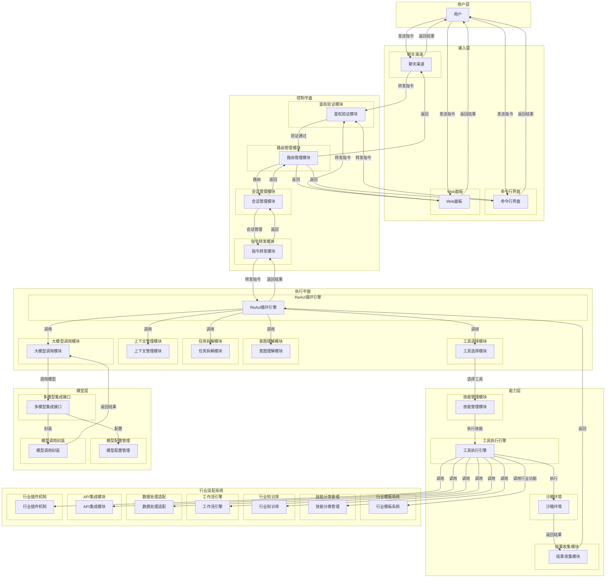

# OpenClaw（小龙虾）架构分析

## 架构分层与模块功能表

| 分层 | 模块 | 功能描述 |
|------|------|----------|
| **接入层** | 聊天渠道 | 接收用户通过飞书、钉钉、微信等聊天工具发送的指令，将消息格式转换为系统内部格式，将执行结果返回给用户 |
| | 命令行界面 | 提供系统管理和维护命令，支持自动化脚本集成，允许远程操作和高级配置，显示执行结果和日志信息 |
| | Web面板 | 提供可视化管理界面，支持技能安装和管理，展示任务执行状态和历史，适合非技术用户操作 |
| **控制平面** | 鉴权验证模块 | 使用API密钥或令牌进行身份验证，验证接入渠道的合法性和权限，检查用户的操作权限范围，实现基于角色的访问控制（RBAC） |
| | 路由管理模块 | 基于消息内容和上下文进行智能路由，维护渠道到Agent的映射关系，支持负载均衡和故障转移，实现消息的优先级排序 |
| | 会话管理模块 | 为每个用户会话生成唯一的Session ID，维护会话状态和上下文信息，支持会话持久化和恢复，实现会话超时和清理机制 |
| | 指令转发模块 | 对指令进行格式转换和标准化，添加上下文信息和元数据，进行指令验证和安全检查，转发给对应的执行平面组件 |
| **执行平面** | ReAct循环引擎 | 实现Reasoning + Acting循环，控制整个执行流程，管理循环迭代和终止条件 |
| | 意图理解模块 | 对用户指令进行语义分析和意图识别，提取关键信息和目标，确定任务类型和优先级 |
| | 任务拆解模块 | 将复杂任务分解为可执行的子任务，构建任务执行计划和步骤，处理任务依赖关系 |
| | 上下文管理模块 | 检索当前会话的历史记录，分析之前的对话内容和用户偏好，整合相关背景信息 |
| | 大模型调用模块 | 构建包含任务描述、上下文和执行计划的提示词，向配置的大模型发送请求，获取大模型的推理和建议，解析大模型返回的思考过程和决策 |
| | 工具选择模块 | 根据大模型的建议评估可用工具，分析工具的输入参数和预期输出，确定工具调用的顺序和依赖关系 |
| **能力层** | 技能管理模块 | 管理技能的注册、加载和卸载，维护技能库和技能元数据，处理技能依赖关系 |
| | 工具执行引擎 | 执行文件操作（读写、格式转换、文件系统管理），执行浏览器操作（网页导航、表单提交、数据抓取），执行API调用（调用外部服务、处理响应），执行系统操作（桌面图像识别、鼠标键盘模拟、系统命令） |
| | 沙箱环境 | 为技能提供隔离的执行环境，限制对系统资源的访问，防止恶意操作和安全风险 |
| | 结果收集模块 | 跟踪技能执行的状态，收集技能执行的输出数据，将执行结果封装为标准格式，准备结果返回给Agent |
| **模型层** | 多模型集成接口 | 集成多种主流大模型（Anthropic Claude、OpenAI GPT、Google Gemini等），支持本地Ollama模型，提供统一的模型调用接口 |
| | 模型配置管理 | 管理模型的配置参数，支持模型的动态切换，优化模型调用参数 |
| | 模型调用封装 | 处理模型调用的请求和响应，管理模型调用的重试和错误处理，优化模型调用的性能和成本 |
| **行业适配系统** | 行业模板系统 | 预定义行业特定的配置模板，包含行业常用工具和技能的集合，针对不同行业的优化参数设置 |
| | 技能分类管理 | 按行业分类组织技能库，行业专用技能的自动识别和加载，技能间的行业特定依赖关系管理 |
| | 行业知识库 | 内置行业特定的知识图谱，行业术语和专业词汇的识别和处理，行业最佳实践的集成 |
| | 工作流引擎 | 行业特定工作流程的定义和执行，工作流的可视化配置和管理，工作流模板的保存和重用 |
| | 数据处理适配 | 行业特定数据格式的解析和处理，数据安全和合规性处理，行业标准的数据交换格式支持 |
| | API集成模块 | 与行业特定系统的API集成，标准和非标准API的适配层，数据同步和实时更新机制 |
| | 行业插件机制 | 支持行业内容的独立开发和集成，定义统一的插件接口和规范，提供插件的安装、卸载、更新和版本管理 |

## 架构部件关系

1. **数据流**：用户指令 → 接入层 → 控制平面 → 执行平面 → 能力层 → 执行平面 → 控制平面 → 接入层 → 用户

2. **依赖关系**：
   - 接入层依赖控制平面进行指令处理
   - 控制平面依赖执行平面进行任务执行
   - 执行平面依赖能力层执行具体操作
   - 能力层依赖模型层提供智能决策
   - 行业适配系统依赖能力层和执行平面实现行业特定功能

3. **调用关系**：
   - 接入层调用控制平面的路由和会话管理
   - 控制平面调用执行平面的ReAct循环
   - 执行平面调用能力层的技能和工具
   - 执行平面调用模型层的大模型
   - 能力层调用行业适配系统的行业特定功能

## 详细架构图

此架构设计实现了OpenClaw的核心能力：从"思考"到"行动"的跨越，为大模型装上"手脚"，实现端到端的任务自动化执行。

## 场景详细分析

### 4.1 日常办公场景

#### 4.1.1 文档处理

| 场景 | 用户操作 | OpenClaw内部处理 | 各模块处理 | 各插件处理 |
|------|----------|------------------|------------|------------|
| 文档处理 | 在聊天框中输入："帮我生成一份项目计划文档" | 接入层接收指令 控制平面进行鉴权和路由 执行平面理解意图：需要生成项目计划文档 任务拆解：确定文档结构、内容要点 调用大模型生成文档内容 工具选择：选择文档生成技能 能力层执行文档生成 结果整理和返回 | 聊天渠道接收用户指令 鉴权验证模块验证用户身份 路由管理模块路由到执行平面 会话管理模块创建会话 指令转发模块转发指令 ReAct循环引擎启动循环 意图理解模块识别生成文档意图 任务拆解模块拆解任务步骤 上下文管理模块获取上下文 大模型调用模块调用模型生成内容 工具选择模块选择文档生成技能 技能管理模块加载技能 工具执行引擎执行技能 沙箱环境隔离执行 结果收集模块收集结果 返回结果给用户 | 调用文档生成技能 使用模板引擎创建文档结构 调用大模型API生成具体内容 格式化文档输出 保存到指定位置 |

#### 4.1.2 办公流程自动化

| 场景 | 用户操作 | OpenClaw内部处理 | 各模块处理 | 各插件处理 |
|------|----------|------------------|------------|------------|
| 邮件自动处理 | 输入："帮我处理今天的邮件，标记重要邮件" | 接收用户指令 解析指令：需要处理邮件并标记重要邮件 调用邮件处理技能 连接到邮箱服务 分析邮件内容和重要性 执行标记操作 返回处理结果 | 聊天渠道接收指令 鉴权验证模块验证用户 路由管理模块路由指令 会话管理模块管理会话 指令转发模块转发指令 ReAct循环引擎启动循环 意图理解模块识别邮件处理意图 任务拆解模块拆解处理步骤 上下文管理模块获取上下文 大模型调用模块调用模型分析 工具选择模块选择邮件处理技能 技能管理模块加载技能 工具执行引擎执行技能 沙箱环境隔离执行 结果收集模块收集结果 返回结果给用户 | 调用邮件API连接邮箱 获取邮件列表和内容 使用NLP分析邮件重要性 自动标记重要邮件 生成处理报告 |

#### 4.1.3 数据处理

| 场景 | 用户操作 | OpenClaw内部处理 | 各模块处理 | 各插件处理 |
|------|----------|------------------|------------|------------|
| 数据整理和分析 | 输入："分析这个Excel文件中的销售数据" | 接收指令和文件 理解任务：需要分析销售数据 任务拆解：读取数据→分析数据→生成报告 调用数据处理技能 执行数据分析 生成可视化报告 返回分析结果 | 聊天渠道接收指令和文件 鉴权验证模块验证用户 路由管理模块路由指令 会话管理模块管理会话 指令转发模块转发指令 ReAct循环引擎启动循环 意图理解模块识别数据分析意图 任务拆解模块拆解分析步骤 上下文管理模块获取上下文 大模型调用模块调用模型分析 工具选择模块选择数据处理技能 技能管理模块加载技能 工具执行引擎执行技能 沙箱环境隔离执行 结果收集模块收集结果 返回结果给用户 | 读取Excel文件 使用pandas处理数据 执行统计分析 生成图表和报告 导出分析结果 |

### 4.2 开发与编程场景

#### 4.2.1 代码生成与优化

| 场景 | 用户操作 | OpenClaw内部处理 | 各模块处理 | 各插件处理 |
|------|----------|------------------|------------|------------|
| 代码生成 | 输入："帮我写一个Python函数来计算斐波那契数列" | 接收代码生成请求 理解需求：生成斐波那契数列函数 调用大模型生成代码 代码质量检查 生成代码注释 返回完整代码 | 聊天渠道接收指令 鉴权验证模块验证用户 路由管理模块路由指令 会话管理模块管理会话 指令转发模块转发指令 ReAct循环引擎启动循环 意图理解模块识别代码生成意图 任务拆解模块拆解生成步骤 上下文管理模块获取上下文 大模型调用模块调用模型生成代码 工具选择模块选择代码生成技能 技能管理模块加载技能 工具执行引擎执行技能 沙箱环境隔离执行 结果收集模块收集结果 返回结果给用户 | 调用代码生成技能 使用大模型API生成代码 执行代码静态分析 添加代码注释 格式化代码输出 |

#### 4.2.2 开发工具集成

| 场景 | 用户操作 | OpenClaw内部处理 | 各模块处理 | 各插件处理 |
|------|----------|------------------|------------|------------|
| 版本控制操作 | 输入："帮我创建一个新的Git分支并提交代码" | 接收Git操作指令 理解任务：创建分支并提交代码 任务拆解：创建分支→添加文件→提交 调用Git操作技能 执行Git命令 返回操作结果 | 聊天渠道接收指令 鉴权验证模块验证用户 路由管理模块路由指令 会话管理模块管理会话 指令转发模块转发指令 ReAct循环引擎启动循环 意图理解模块识别Git操作意图 任务拆解模块拆解操作步骤 上下文管理模块获取上下文 大模型调用模块调用模型分析 工具选择模块选择Git操作技能 技能管理模块加载技能 工具执行引擎执行技能 沙箱环境隔离执行 结果收集模块收集结果 返回结果给用户 | 调用Git API 执行git branch命令 执行git add命令 执行git commit命令 返回操作日志 |

#### 4.2.3 技术文档

| 场景 | 用户操作 | OpenClaw内部处理 | 各模块处理 | 各插件处理 |
|------|----------|------------------|------------|------------|
| API文档生成 | 输入："根据这个代码文件生成API文档" | 接收代码文件 理解任务：生成API文档 分析代码结构和函数定义 调用文档生成技能 生成API文档 返回文档内容 | 聊天渠道接收指令和文件 鉴权验证模块验证用户 路由管理模块路由指令 会话管理模块管理会话 指令转发模块转发指令 ReAct循环引擎启动循环 意图理解模块识别文档生成意图 任务拆解模块拆解生成步骤 上下文管理模块获取上下文 大模型调用模块调用模型生成文档 工具选择模块选择文档生成技能 技能管理模块加载技能 工具执行引擎执行技能 沙箱环境隔离执行 结果收集模块收集结果 返回结果给用户 | 解析代码文件 提取函数和类定义 生成文档结构 调用大模型生成说明 格式化文档输出 |

### 4.3 创意与设计场景

#### 4.3.1 思维导图/流程图

| 场景 | 用户操作 | OpenClaw内部处理 | 各模块处理 | 各插件处理 |
|------|----------|------------------|------------|------------|
| 思维导图生成 | 输入："帮我画一个关于AI发展历史的思维导图" | 接收思维导图生成请求 理解主题：AI发展历史 调用大模型生成思维导图内容 调用绘图技能 生成思维导图 返回图片或文件 | 聊天渠道接收指令 鉴权验证模块验证用户 路由管理模块路由指令 会话管理模块管理会话 指令转发模块转发指令 ReAct循环引擎启动循环 意图理解模块识别思维导图生成意图 任务拆解模块拆解生成步骤 上下文管理模块获取上下文 大模型调用模块调用模型生成内容 工具选择模块选择绘图技能 技能管理模块加载技能 工具执行引擎执行技能 沙箱环境隔离执行 结果收集模块收集结果 返回结果给用户 | 调用大模型生成结构化内容 使用绘图工具生成思维导图 添加节点和连接线 美化图表样式 导出为图片或文件 |

#### 4.3.2 内容创作

| 场景 | 用户操作 | OpenClaw内部处理 | 各模块处理 | 各插件处理 |
|------|----------|------------------|------------|------------|
| 文章写作 | 输入："帮我写一篇关于人工智能发展趋势的文章" | 接收写作请求 理解主题：人工智能发展趋势 调用大模型生成文章内容 内容质量检查 格式化文章 返回完整文章 | 聊天渠道接收指令 鉴权验证模块验证用户 路由管理模块路由指令 会话管理模块管理会话 指令转发模块转发指令 ReAct循环引擎启动循环 意图理解模块识别文章写作意图 任务拆解模块拆解写作步骤 上下文管理模块获取上下文 大模型调用模块调用模型生成文章 工具选择模块选择内容创作技能 技能管理模块加载技能 工具执行引擎执行技能 沙箱环境隔离执行 结果收集模块收集结果 返回结果给用户 | 调用大模型API生成文章 进行内容优化和润色 添加标题和段落结构 检查语法和拼写 格式化输出 |

#### 4.3.3 设计辅助

| 场景 | 用户操作 | OpenClaw内部处理 | 各模块处理 | 各插件处理 |
|------|----------|------------------|------------|------------|
| UI设计建议 | 输入："为这个电商APP提供UI设计建议" | 接收设计建议请求 理解需求：电商APP UI设计 调用大模型生成设计建议 分析设计原则 生成具体建议 返回设计建议 | 聊天渠道接收指令 鉴权验证模块验证用户 路由管理模块路由指令 会话管理模块管理会话 指令转发模块转发指令 ReAct循环引擎启动循环 意图理解模块识别设计建议意图 任务拆解模块拆解分析步骤 上下文管理模块获取上下文 大模型调用模块调用模型生成建议 工具选择模块选择设计辅助技能 技能管理模块加载技能 工具执行引擎执行技能 沙箱环境隔离执行 结果收集模块收集结果 返回结果给用户 | 调用大模型生成设计思路 分析电商APP特点 提供UI/UX建议 生成设计原型描述 输出设计文档 |

### 4.4 行业应用场景

#### 4.4.1 医疗健康

| 场景 | 用户操作 | OpenClaw内部处理 | 各模块处理 | 各插件处理 |
|------|----------|------------------|------------|------------|
| 医疗数据处理 | 输入："分析这份患者数据，生成健康报告" | 接收医疗数据 理解任务：分析患者数据 调用医疗数据处理技能 执行数据分析 生成健康报告 返回分析结果 | 聊天渠道接收指令和数据 鉴权验证模块验证用户 路由管理模块路由指令 会话管理模块管理会话 指令转发模块转发指令 ReAct循环引擎启动循环 意图理解模块识别医疗分析意图 任务拆解模块拆解分析步骤 上下文管理模块获取上下文 大模型调用模块调用模型分析 工具选择模块选择医疗数据处理技能 技能管理模块加载技能 工具执行引擎执行技能 沙箱环境隔离执行 结果收集模块收集结果 返回结果给用户 | 调用医疗数据处理技能 解析患者数据 执行健康指标分析 生成可视化报告 输出健康建议 |

#### 4.4.2 制造业

| 场景 | 用户操作 | OpenClaw内部处理 | 各模块处理 | 各插件处理 |
|------|----------|------------------|------------|------------|
| 生产流程优化 | 输入："分析生产数据，提供优化建议" | 接收生产数据 理解任务：优化生产流程 调用制造业分析技能 执行数据分析 生成优化建议 返回优化方案 | 聊天渠道接收指令和数据 鉴权验证模块验证用户 路由管理模块路由指令 会话管理模块管理会话 指令转发模块转发指令 ReAct循环引擎启动循环 意图理解模块识别生产优化意图 任务拆解模块拆解优化步骤 上下文管理模块获取上下文 大模型调用模块调用模型分析 工具选择模块选择制造业分析技能 技能管理模块加载技能 工具执行引擎执行技能 沙箱环境隔离执行 结果收集模块收集结果 返回结果给用户 | 调用制造业分析技能 分析生产数据 识别瓶颈和问题 生成优化建议 输出改进方案 |

#### 4.4.3 金融服务

| 场景 | 用户操作 | OpenClaw内部处理 | 各模块处理 | 各插件处理 |
|------|----------|------------------|------------|------------|
| 风险评估 | 输入："评估这个投资组合的风险" | 接收投资组合数据 理解任务：风险评估 调用金融分析技能 执行风险分析 生成评估报告 返回风险评估结果 | 聊天渠道接收指令和数据 鉴权验证模块验证用户 路由管理模块路由指令 会话管理模块管理会话 指令转发模块转发指令 ReAct循环引擎启动循环 意图理解模块识别风险评估意图 任务拆解模块拆解评估步骤 上下文管理模块获取上下文 大模型调用模块调用模型分析 工具选择模块选择金融分析技能 技能管理模块加载技能 工具执行引擎执行技能 沙箱环境隔离执行 结果收集模块收集结果 返回结果给用户 | 调用金融分析技能 分析投资组合 计算风险指标 生成风险评估报告 输出投资建议 |

### 4.5 自动化操作场景

#### 4.5.1 电脑自动操作

| 场景 | 用户操作 | OpenClaw内部处理 | 各模块处理 | 各插件处理 |
|------|----------|------------------|------------|------------|
| 应用程序控制 | 输入："帮我打开Excel并创建一个新的工作簿" | 接收操作指令 理解任务：控制Excel应用 调用系统操作技能 执行应用程序控制 监控执行结果 返回操作状态 | 聊天渠道接收指令 鉴权验证模块验证用户 路由管理模块路由指令 会话管理模块管理会话 指令转发模块转发指令 ReAct循环引擎启动循环 意图理解模块识别应用控制意图 任务拆解模块拆解控制步骤 上下文管理模块获取上下文 大模型调用模块调用模型分析 工具选择模块选择系统操作技能 技能管理模块加载技能 工具执行引擎执行技能 沙箱环境隔离执行 结果收集模块收集结果 返回结果给用户 | 调用系统操作技能 模拟鼠标键盘操作 启动Excel应用 创建新工作簿 返回操作结果 |

#### 4.5.2 文件管理

| 场景 | 用户操作 | OpenClaw内部处理 | 各模块处理 | 各插件处理 |
|------|----------|------------------|------------|------------|
| 文件批量处理 | 输入："将这个文件夹中的所有PDF转换为Word" | 接收文件处理指令 理解任务：批量转换PDF到Word 调用文件处理技能 扫描文件夹 执行批量转换 返回处理结果 | 聊天渠道接收指令 鉴权验证模块验证用户 路由管理模块路由指令 会话管理模块管理会话 指令转发模块转发指令 ReAct循环引擎启动循环 意图理解模块识别文件处理意图 任务拆解模块拆解处理步骤 上下文管理模块获取上下文 大模型调用模块调用模型分析 工具选择模块选择文件处理技能 技能管理模块加载技能 工具执行引擎执行技能 沙箱环境隔离执行 结果收集模块收集结果 返回结果给用户 | 调用文件处理技能 扫描指定文件夹 识别PDF文件 执行格式转换 保存转换后的文件 |

#### 4.5.3 浏览器自动化

| 场景 | 用户操作 | OpenClaw内部处理 | 各模块处理 | 各插件处理 |
|------|----------|------------------|------------|------------|
| 网页数据抓取 | 输入："抓取这个网站的商品信息" | 接收网页抓取请求 理解任务：抓取商品信息 调用浏览器自动化技能 打开网页 提取数据 返回抓取结果 | 聊天渠道接收指令 鉴权验证模块验证用户 路由管理模块路由指令 会话管理模块管理会话 指令转发模块转发指令 ReAct循环引擎启动循环 意图理解模块识别网页抓取意图 任务拆解模块拆解抓取步骤 上下文管理模块获取上下文 大模型调用模块调用模型分析 工具选择模块选择浏览器自动化技能 技能管理模块加载技能 工具执行引擎执行技能 沙箱环境隔离执行 结果收集模块收集结果 返回结果给用户 | 调用浏览器自动化技能 启动浏览器 导航到目标网页 解析网页结构 提取商品数据 导出数据文件 |

### 4.6 插件开发场景

#### 4.6.1 插件项目初始化

| 场景 | 用户操作 | OpenClaw内部处理 | 各模块处理 | 各插件处理 |
|------|----------|------------------|------------|------------|
| 插件项目初始化 | 输入："创建医疗行业插件项目" | 接收插件创建请求 理解行业插件需求 提供插件开发SDK和模板 生成插件项目结构 配置开发环境 返回项目初始化结果 | 聊天渠道接收指令 鉴权验证模块验证用户 路由管理模块路由指令 会话管理模块管理会话 指令转发模块转发指令 ReAct循环引擎启动循环 意图理解模块识别插件创建意图 任务拆解模块拆解创建步骤 上下文管理模块获取上下文 大模型调用模块调用模型生成项目结构 工具选择模块选择插件开发工具 技能管理模块加载插件开发技能 工具执行引擎执行项目创建 沙箱环境隔离执行 结果收集模块收集结果 返回结果给用户 | 加载插件开发模板 生成项目目录结构 配置插件元数据 初始化依赖管理 设置开发环境 |

#### 4.6.2 插件功能开发

| 场景 | 用户操作 | OpenClaw内部处理 | 各模块处理 | 各插件处理 |
|------|----------|------------------|------------|------------|
| 插件功能开发 | 输入："开发医疗数据处理功能" | 接收功能开发请求 理解功能需求 提供开发API和文档 支持技能开发框架 提供调试工具 返回开发支持结果 | 聊天渠道接收指令 鉴权验证模块验证用户 路由管理模块路由指令 会话管理模块管理会话 指令转发模块转发指令 ReAct循环引擎启动循环 意图理解模块识别功能开发意图 任务拆解模块拆解开发步骤 上下文管理模块获取上下文 大模型调用模块调用模型生成代码 工具选择模块选择开发工具 技能管理模块加载开发技能 工具执行引擎执行代码生成 沙箱环境隔离执行 结果收集模块收集结果 返回结果给用户 | 实现医疗数据处理逻辑 集成行业特定算法 调用行业知识服务 实现数据安全处理 优化功能性能 |

#### 4.6.3 插件测试与调试

| 场景 | 用户操作 | OpenClaw内部处理 | 各模块处理 | 各插件处理 |
|------|----------|------------------|------------|------------|
| 插件测试与调试 | 输入："测试医疗插件功能" | 接收测试请求 理解测试需求 提供测试环境和工具 支持插件调试模式 收集测试数据 分析测试结果 返回测试支持结果 | 聊天渠道接收指令 鉴权验证模块验证用户 路由管理模块路由指令 会话管理模块管理会话 指令转发模块转发指令 ReAct循环引擎启动循环 意图理解模块识别测试意图 任务拆解模块拆解测试步骤 上下文管理模块获取上下文 大模型调用模块调用模型分析测试 工具选择模块选择测试工具 技能管理模块加载测试技能 工具执行引擎执行测试 沙箱环境隔离执行 结果收集模块收集结果 返回结果给用户 | 执行插件功能测试 验证行业知识集成 测试数据处理性能 检查错误处理机制 生成测试报告 |

### 4.7 行业模板开发场景

#### 4.7.1 行业模板创建

| 场景 | 用户操作 | OpenClaw内部处理 | 各模块处理 | 各插件处理 |
|------|----------|------------------|------------|------------|
| 行业模板创建 | 输入："创建医疗行业模板" | 接收模板创建请求 理解行业模板需求 提供模板开发框架 生成模板结构 配置模板参数 返回模板创建结果 | 聊天渠道接收指令 鉴权验证模块验证用户 路由管理模块路由指令 会话管理模块管理会话 指令转发模块转发指令 ReAct循环引擎启动循环 意图理解模块识别模板创建意图 任务拆解模块拆解创建步骤 上下文管理模块获取上下文 大模型调用模块调用模型生成模板 工具选择模块选择模板开发工具 技能管理模块加载模板开发技能 工具执行引擎执行模板创建 沙箱环境隔离执行 结果收集模块收集结果 返回结果给用户 | 加载行业模板系统 生成模板配置文件 配置行业参数 集成行业技能 设置行业工作流程 |

#### 4.7.2 行业模板调试

| 场景 | 用户操作 | OpenClaw内部处理 | 各模块处理 | 各插件处理 |
|------|----------|------------------|------------|------------|
| 行业模板调试 | 输入："调试医疗行业模板" | 接收模板调试请求 理解调试需求 提供调试环境和工具 支持模板调试模式 收集调试数据 分析调试结果 返回调试支持结果 | 聊天渠道接收指令 鉴权验证模块验证用户 路由管理模块路由指令 会话管理模块管理会话 指令转发模块转发指令 ReAct循环引擎启动循环 意图理解模块识别调试意图 任务拆解模块拆解调试步骤 上下文管理模块获取上下文 大模型调用模块调用模型分析调试 工具选择模块选择调试工具 技能管理模块加载调试技能 工具执行引擎执行调试 沙箱环境隔离执行 结果收集模块收集结果 返回结果给用户 | 加载行业模板 测试模板功能 验证模板配置 检查技能集成 生成调试报告 |

#### 4.7.3 行业模板测试

| 场景 | 用户操作 | OpenClaw内部处理 | 各模块处理 | 各插件处理 |
|------|----------|------------------|------------|------------|
| 行业模板测试 | 输入："测试医疗行业模板" | 接收模板测试请求 理解测试需求 提供测试环境和工具 支持模板测试模式 收集测试数据 分析测试结果 返回测试支持结果 | 聊天渠道接收指令 鉴权验证模块验证用户 路由管理模块路由指令 会话管理模块管理会话 指令转发模块转发指令 ReAct循环引擎启动循环 意图理解模块识别测试意图 任务拆解模块拆解测试步骤 上下文管理模块获取上下文 大模型调用模块调用模型分析测试 工具选择模块选择测试工具 技能管理模块加载测试技能 工具执行引擎执行测试 沙箱环境隔离执行 结果收集模块收集结果 返回结果给用户 | 执行模板功能测试 验证行业知识集成 测试工作流程 检查API集成 生成测试报告 |