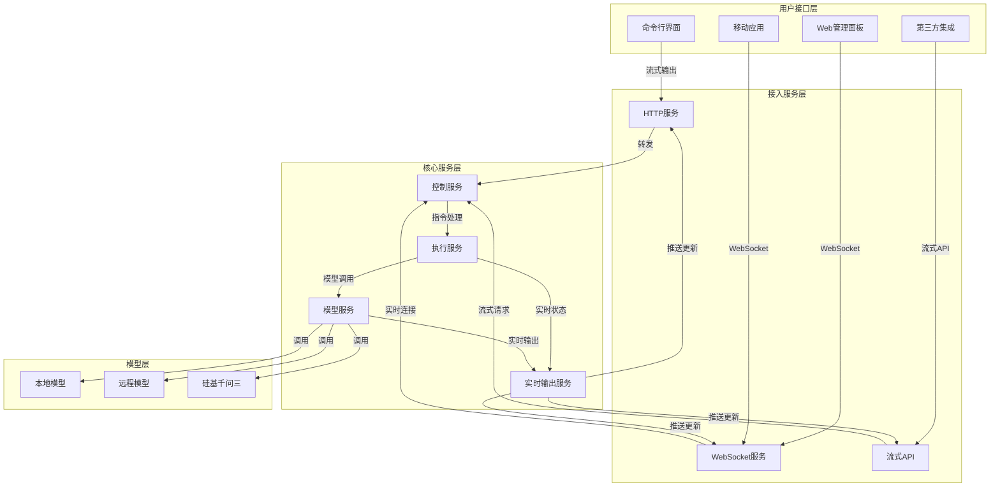
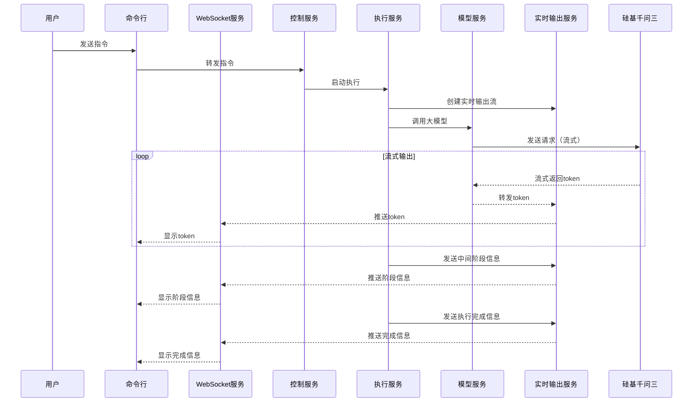

# 八爪鱼实时输出功能设计文档

## 1. 概述

本文档详细描述八爪鱼（Octopus）AI智能体执行框架的实时输出功能设计，包括各种用户接口如何支持实时的输出，感知中间的阶段信息和每个阶段的实时数据（大模型实时输出），参考业界流行的大模型交互过程。

## 2. 设计目标

- **实时性**：支持大模型的流式输出，实时展示生成内容
- **透明度**：展示中间阶段信息，让用户了解系统的思考和执行过程
- **多接口支持**：在命令行、Web面板、移动应用等多种用户接口中实现实时输出
- **用户体验**：提供流畅、直观的实时输出体验，参考业界最佳实践
- **可扩展性**：设计可扩展的实时输出架构，支持未来功能扩展

## 3. 系统架构

### 3.1 整体架构



### 3.2 核心组件

| 组件 | 描述 | 功能 |
|------|------|------|
| **实时输出服务** | 核心实时输出管理 | 管理实时输出流，处理大模型流式输出，推送中间阶段信息 |
| **WebSocket服务** | WebSocket连接管理 | 维护与前端的WebSocket连接，实时推送数据 |
| **流式API** | 流式HTTP接口 | 提供HTTP流式接口，支持第三方集成 |
| **模型服务** | 模型调用管理 | 处理与大模型的交互，支持流式输出 |
| **执行服务** | 执行过程管理 | 管理执行过程，收集中间阶段信息 |

## 4. 功能设计

### 4.1 实时输出类型

| 输出类型 | 描述 | 应用场景 |
|----------|------|----------|
| **大模型实时输出** | 大模型生成内容的实时流式输出 | 文本生成、代码生成、内容创作 |
| **中间阶段信息** | ReAct循环的各个阶段信息 | 意图理解、任务拆解、工具选择、执行结果 |
| **工具执行状态** | 工具执行的实时状态 | 文件操作、网络请求、系统操作 |
| **系统状态信息** | 系统运行的状态信息 | 资源使用、执行进度、错误信息 |

### 4.2 实时输出格式

#### 4.2.1 大模型实时输出

```json
{
  "type": "model_output",
  "data": {
    "token": "Hello",
    "complete": false,
    "model": "Qwen/Qwen3-8B",
    "timestamp": "2026-03-26T10:00:00Z"
  }
}
```

#### 4.2.2 中间阶段信息

```json
{
  "type": "stage_info",
  "data": {
    "stage": "task_decomposition",
    "message": "正在拆解任务...",
    "details": {
      "task": "生成一份产品报告",
      "subtasks": ["收集产品信息", "分析市场数据", "撰写报告"]
    },
    "timestamp": "2026-03-26T10:00:00Z"
  }
}
```

#### 4.2.3 工具执行状态

```json
{
  "type": "tool_status",
  "data": {
    "tool": "file_tool",
    "action": "read",
    "status": "running",
    "progress": 50,
    "details": {
      "file_path": "report.md"
    },
    "timestamp": "2026-03-26T10:00:00Z"
  }
}
```

### 4.3 用户接口实现

#### 4.3.1 命令行界面

- **实现方式**：使用Python的`sys.stdout`实时输出，支持ANSI转义序列美化
- **功能特性**：
  - 实时显示大模型输出，逐字显示
  - 显示中间阶段信息，使用不同颜色区分
  - 支持进度条显示工具执行状态
  - 支持交互式输入和实时输出并行

#### 4.3.2 Web管理面板

- **实现方式**：使用WebSocket连接，前端使用Vue 3 + WebSocket API
- **功能特性**：
  - 实时显示大模型输出，支持Markdown渲染
  - 显示中间阶段信息，使用卡片式布局
  - 支持执行过程可视化，使用流程图展示
  - 支持实时状态更新和进度显示

#### 4.3.3 移动应用

- **实现方式**：使用WebSocket连接，移动应用使用Vue + NativeScript
- **功能特性**：
  - 实时显示大模型输出，支持自适应布局
  - 显示中间阶段信息，使用通知式设计
  - 支持后台执行和推送通知
  - 支持离线缓存和恢复

#### 4.3.4 第三方集成

- **实现方式**：提供流式HTTP API，支持Server-Sent Events (SSE)或WebSocket
- **功能特性**：
  - 标准的流式API接口
  - 支持自定义输出格式
  - 提供认证和授权机制
  - 支持速率限制和流量控制

## 5. 技术实现

### 5.1 实时输出服务

- **实现语言**：Python 3.9+
- **核心库**：
  - `websockets`：WebSocket服务器
  - `asyncio`：异步处理
  - `fastapi`：HTTP和流式API
- **主要功能**：
  - 管理WebSocket连接池
  - 处理流式输出数据
  - 推送实时更新到客户端
  - 处理连接断开和重连

### 5.2 模型服务

- **实现语言**：Python 3.9+
- **核心库**：
  - `aiohttp`：异步HTTP客户端
  - `requests`：HTTP客户端
- **主要功能**：
  - 支持大模型的流式API调用
  - 处理流式响应和实时解析
  - 转换模型输出为统一格式
  - 管理模型连接和重试

### 5.3 执行服务

- **实现语言**：Python 3.9+
- **核心库**：
  - `asyncio`：异步处理
  - `logging`：日志管理
- **主要功能**：
  - 收集执行过程中的中间阶段信息
  - 实时更新执行状态
  - 与实时输出服务交互
  - 处理执行错误和异常

### 5.4 前端实现

- **技术栈**：
  - Vue 3
  - Pinia（状态管理）
  - Vue Router（路由）
  - Element Plus（UI组件）
- **主要功能**：
  - WebSocket连接管理
  - 实时数据处理和渲染
  - 响应式布局和动画
  - 错误处理和用户反馈

## 6. 工作流程

### 6.1 实时输出流程

1. **用户发送指令**：用户通过命令行、Web界面或其他接口发送指令
2. **指令处理**：接入服务接收指令并转发给控制服务
3. **执行初始化**：控制服务启动执行流程，创建实时输出流
4. **模型调用**：执行服务调用模型服务，请求大模型推理
5. **流式输出**：模型服务接收大模型的流式输出，实时转发给实时输出服务
6. **中间阶段信息**：执行服务收集中间阶段信息，发送给实时输出服务
7. **推送更新**：实时输出服务将数据推送给各个用户接口
8. **用户接收**：用户接口接收并显示实时输出
9. **执行完成**：执行完成后，发送完成状态和最终结果

### 6.2 示例流程



## 7. 性能优化

### 7.1 网络优化

- **数据压缩**：使用gzip压缩WebSocket数据
- **批量发送**：合并小数据包，减少网络开销
- **连接复用**：复用WebSocket连接，减少连接建立开销
- **流量控制**：实现客户端流量控制，避免过载

### 7.2 处理优化

- **异步处理**：使用asyncio实现异步处理，提高并发性能
- **缓冲区管理**：优化输出缓冲区，减少内存使用
- **优先级队列**：实现优先级队列，确保重要信息优先处理
- **批处理**：对非实时性数据进行批处理，减少处理开销

### 7.3 前端优化

- **虚拟滚动**：使用虚拟滚动处理大量输出数据
- **防抖处理**：对频繁更新进行防抖处理，减少渲染开销
- **Web Worker**：使用Web Worker处理数据，避免阻塞主线程
- **缓存策略**：实现合理的缓存策略，减少重复渲染

## 8. 安全考虑

### 8.1 连接安全

- **WebSocket安全**：使用WSS（WebSocket Secure）协议
- **认证授权**：实现WebSocket连接的认证和授权
- **速率限制**：对WebSocket连接实施速率限制，防止滥用
- **连接监控**：监控异常连接，及时断开恶意连接

### 8.2 数据安全

- **数据加密**：加密传输的实时数据
- **敏感信息过滤**：过滤输出中的敏感信息
- **访问控制**：基于用户权限控制实时输出的访问
- **审计日志**：记录实时输出的访问和操作

## 9. 测试策略

### 9.1 功能测试

- **单元测试**：测试各个组件的功能
- **集成测试**：测试组件间的集成
- **端到端测试**：测试完整的实时输出流程
- **模拟测试**：使用模拟数据测试实时输出功能

### 9.2 性能测试

- **吞吐量测试**：测试系统处理实时输出的吞吐量
- **延迟测试**：测试实时输出的延迟
- **并发测试**：测试系统处理并发实时输出的能力
- **负载测试**：测试系统在高负载下的表现

### 9.3 兼容性测试

- **浏览器兼容性**：测试不同浏览器的兼容性
- **设备兼容性**：测试不同设备的兼容性
- **网络环境**：测试不同网络环境下的表现
- **降级策略**：测试网络不佳时的降级策略

## 10. 实施计划

### 10.1 阶段一：基础实现（v0.1.0 MVP）

- 实现命令行界面的实时输出
- 集成硅基千问三的流式API
- 实现基本的实时输出机制

### 10.2 阶段二：扩展实现（v0.2.0 Alpha）

- 实现WebSocket服务
- 实现Web管理面板的实时输出
- 实现实时输出管理模块

### 10.3 阶段三：完善实现（v0.3.0 Beta）

- 实现ReAct循环的中间阶段信息输出
- 实现工具执行状态的实时输出
- 优化实时输出性能

### 10.4 阶段四：优化与扩展（v1.0.0 Stable）

- 实现移动应用的实时输出
- 实现第三方集成的流式API
- 完善安全和性能优化

## 11. 总结

本设计文档详细描述了八爪鱼实时输出功能的整体方案，包括系统架构、功能设计、技术实现、工作流程、性能优化、安全考虑和测试策略。通过实时输出功能，八爪鱼能够为用户提供更加透明、流畅的交互体验，让用户能够实时了解系统的思考和执行过程，参考业界流行的大模型交互过程。

实时输出功能不仅提升了用户体验，也增强了系统的可调试性和可监控性，为八爪鱼的发展和用户 adoption 提供了有力支持。

---

**文档版本**：v1.0  
**创建日期**：2026-03-26  
**最后更新**：2026-03-26  
**维护者**：八爪鱼架构团队
