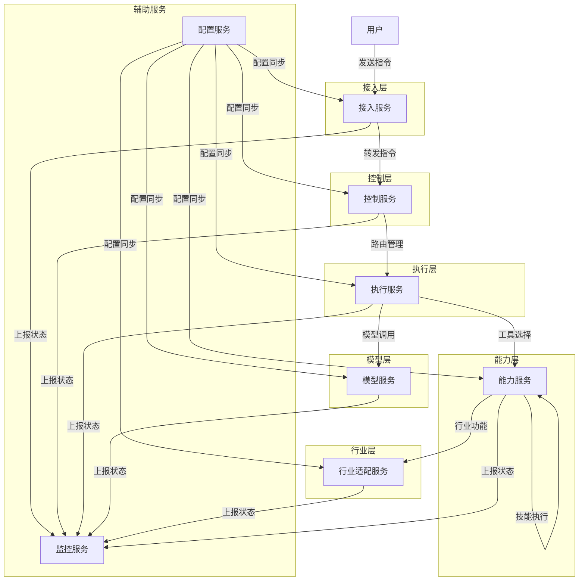
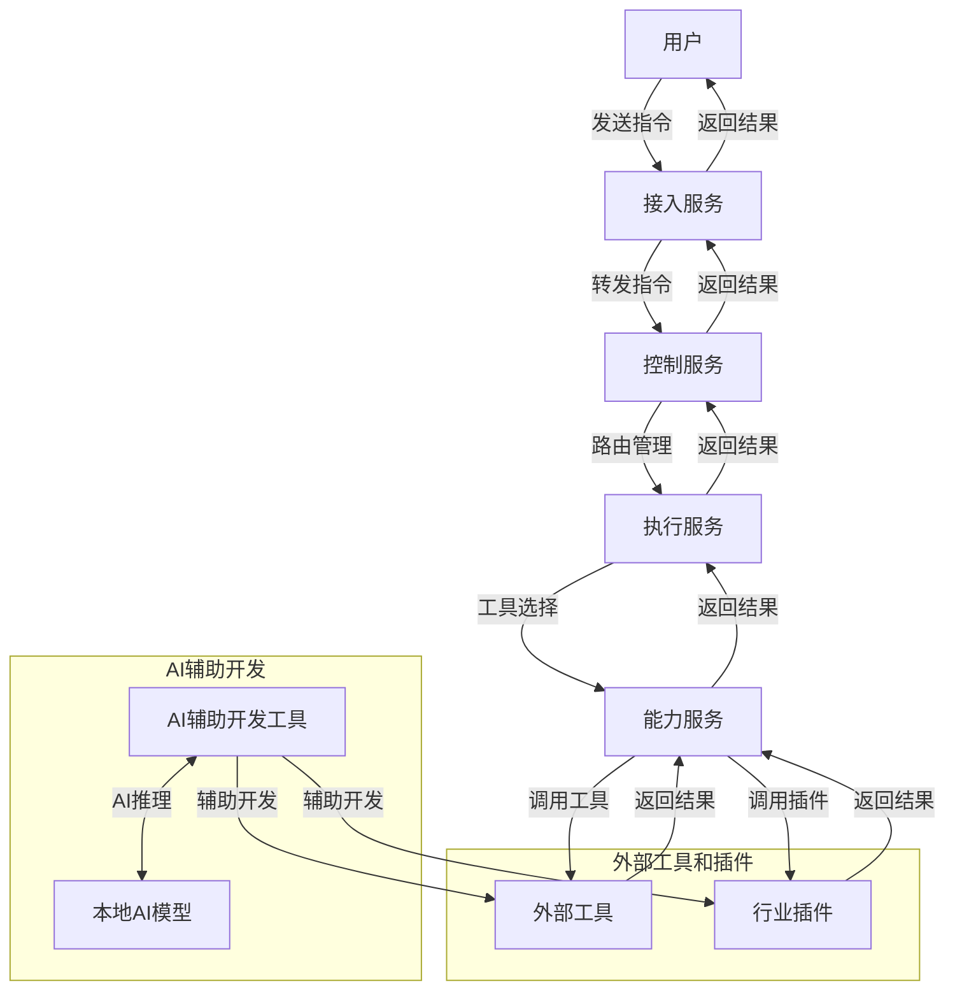

# 八爪鱼（Octopus）微服务架构文档

## 1. 架构概述

八爪鱼是一个开源的AI智能体执行框架，致力于实现从"思考"到"行动"的跨越，为大模型装上"手脚"，实现端到端的任务自动化执行。本架构文档基于微服务设计理念，详细描述八爪鱼的服务划分、模块功能、目录结构和职责。

### 1.1 设计原则

- **微服务解耦**：将系统拆分为独立的微服务，每个服务专注于特定功能
- **高内聚低耦合**：服务内部功能高度相关，服务间依赖最小化
- **可扩展性**：支持水平扩展，应对不同规模的负载
- **容错性**：服务故障不影响整体系统运行
- **可维护性**：模块化设计，便于维护和升级

### 1.2 架构演进

| 版本 | 架构类型 | 关键特征 |
|------|----------|----------|
| v0.1.0 - v0.2.0 | 单体架构 | 简单的单体应用，基础模块划分 |
| v0.3.0 - v0.5.0 | 分层架构 | 清晰的分层设计，模块间解耦 |
| v1.0.0 - v1.2.0 | 插件化架构 | 插件机制完善，动态加载能力 |
| v2.0.0+ | 分布式微服务架构 | 微服务架构，集群支持，高可用性 |

## 2. 微服务架构设计

### 2.1 服务划分

| 服务名称 | 服务类型 | 核心功能 | 技术栈 |
|----------|----------|----------|----------|
| **接入服务** | 网关服务 | 多渠道接入，消息格式转换 | Python, FastAPI, WebSocket |
| **控制服务** | 核心服务 | 鉴权验证，路由管理，会话管理 | Python, FastAPI, Redis |
| **执行服务** | 核心服务 | ReAct循环，意图理解，任务拆解 | Python, FastAPI, Redis |
| **能力服务** | 核心服务 | 技能管理，工具执行，沙箱环境 | Python, FastAPI, Docker |
| **模型服务** | 核心服务 | 多模型集成，模型调用封装 | Python, FastAPI, gRPC |
| **行业适配服务** | 业务服务 | 行业模板，插件机制，知识库 | Python, FastAPI, MongoDB |
| **监控服务** | 辅助服务 | 系统监控，日志管理，告警 | Python, Prometheus, Grafana |
| **配置服务** | 辅助服务 | 配置管理，服务发现 | Python, Consul, Vault |

### 2.2 服务间通信

| 通信方式 | 适用场景 | 特点 |
|----------|----------|----------|
| **REST API** | 同步请求-响应 | 简单易用，广泛支持 |
| **WebSocket** | 实时双向通信 | 低延迟，适合长连接 |
| **gRPC** | 高性能服务间通信 | 高效序列化，强类型 |
| **消息队列** | 异步通信 | 解耦，削峰填谷 |
| **Redis** | 缓存和消息传递 | 高性能，支持发布订阅 |

### 2.3 数据流



## 3. 服务详细设计

### 3.1 接入服务（Access Service）

#### 3.1.1 模块划分

| 模块 | 功能描述 | 文件路径 |
|------|----------|----------|
| **聊天渠道** | 处理飞书、钉钉、微信等聊天工具的消息 | `services/access/channels/` |
| **命令行接口** | 处理命令行输入输出 | `services/access/cli/` |
| **Web面板** | 提供Web界面访问 | `services/access/web/` |
| **消息格式转换** | 统一消息格式 | `services/access/format/` |
| **接入网关** | 统一接入入口 | `services/access/gateway/` |

#### 3.1.2 核心功能

- 多渠道接入（飞书、钉钉、微信、命令行、Web面板）
- 消息格式统一转换
- 接入认证和授权
- 消息路由和分发
- 实时消息推送

### 3.2 控制服务（Control Service）

#### 3.2.1 模块划分

| 模块 | 功能描述 | 文件路径 |
|------|----------|----------|
| **鉴权验证** | 用户身份验证和权限管理 | `services/control/auth/` |
| **路由管理** | 指令路由和负载均衡 | `services/control/router/` |
| **会话管理** | 会话状态管理和持久化 | `services/control/session/` |
| **指令转发** | 指令格式转换和验证 | `services/control/forward/` |
| **速率限制** | 请求速率控制 | `services/control/rate_limit/` |

#### 3.2.2 核心功能

- 用户认证和授权
- 基于角色的访问控制（RBAC）
- 智能路由和负载均衡
- 会话状态管理和持久化
- 指令格式标准化
- 请求速率限制和防护

### 3.3 执行服务（Execution Service）

#### 3.3.1 模块划分

| 模块 | 功能描述 | 文件路径 |
|------|----------|----------|
| **ReAct循环引擎** | 控制执行流程和循环 | `services/execution/react/` |
| **意图理解** | 语义分析和意图识别 | `services/execution/intent/` |
| **任务拆解** | 复杂任务分解为子任务 | `services/execution/task/` |
| **上下文管理** | 会话历史和上下文维护 | `services/execution/context/` |
| **工具选择** | 基于任务选择合适工具 | `services/execution/tool_select/` |

#### 3.3.2 核心功能

- Reasoning + Acting循环执行
- 用户意图理解和识别
- 复杂任务自动拆解
- 上下文信息管理和利用
- 智能工具选择和排序
- 执行状态管理和监控

### 3.4 能力服务（Capability Service）

#### 3.4.1 模块划分

| 模块 | 功能描述 | 文件路径 |
|------|----------|----------|
| **技能管理** | 技能注册、加载和卸载 | `services/capability/skill/` |
| **工具执行** | 执行具体工具操作 | `services/capability/executor/` |
| **沙箱环境** | 隔离执行环境 | `services/capability/sandbox/` |
| **结果收集** | 收集和处理执行结果 | `services/capability/result/` |
| **资源管理** | 管理计算和存储资源 | `services/capability/resource/` |

#### 3.4.2 核心功能

- 技能生命周期管理
- 工具执行引擎
- 沙箱隔离保护
- 执行结果收集和处理
- 资源使用监控和限制
- 技能依赖管理

### 3.5 模型服务（Model Service）

#### 3.5.1 模块划分

| 模块 | 功能描述 | 文件路径 |
|------|----------|----------|
| **模型集成** | 多模型接入和管理 | `services/model/integration/` |
| **模型配置** | 模型参数配置管理 | `services/model/config/` |
| **模型调用** | 统一模型调用接口 | `services/model/call/` |
| **模型监控** | 模型调用监控和分析 | `services/model/monitor/` |
| **模型缓存** | 模型响应缓存 | `services/model/cache/` |

#### 3.5.2 核心功能

- 多模型集成（OpenAI、Anthropic、Google、本地Ollama）
- 统一模型调用接口
- 模型参数动态配置
- 模型调用监控和统计
- 智能模型选择和切换
- 调用失败重试和错误处理

### 3.6 行业适配服务（Industry Service）

#### 3.6.1 模块划分

| 模块 | 功能描述 | 文件路径 |
|------|----------|----------|
| **行业模板** | 行业特定配置模板 | `services/industry/template/` |
| **技能分类** | 行业技能分类管理 | `services/industry/skill_class/` |
| **知识库** | 行业知识管理 | `services/industry/knowledge/` |
| **工作流** | 行业工作流定义和执行 | `services/industry/workflow/` |
| **插件机制** | 行业插件管理 | `services/industry/plugin/` |

#### 3.6.2 核心功能

- 行业模板管理和应用
- 行业技能分类和组织
- 行业知识库维护
- 行业工作流定义和执行
- 行业插件开发和管理
- 行业数据处理适配

### 3.7 监控服务（Monitor Service）

#### 3.7.1 模块划分

| 模块 | 功能描述 | 文件路径 |
|------|----------|----------|
| **系统监控** | 服务健康状态监控 | `services/monitor/system/` |
| **日志管理** | 集中化日志收集和分析 | `services/monitor/log/` |
| **性能监控** | 服务性能指标监控 | `services/monitor/performance/` |
| **告警管理** | 异常检测和告警 | `services/monitor/alert/` |
| **可视化** | 监控数据可视化 | `services/monitor/visualization/` |

#### 3.7.2 核心功能

- 服务健康状态监控
- 集中化日志管理
- 性能指标收集和分析
- 异常检测和告警
- 监控数据可视化
- 历史数据存储和分析

### 3.8 配置服务（Config Service）

#### 3.8.1 模块划分

| 模块 | 功能描述 | 文件路径 |
|------|----------|----------|
| **配置管理** | 集中化配置管理 | `services/config/manager/` |
| **服务发现** | 服务注册和发现 | `services/config/discovery/` |
| **密钥管理** | 敏感信息加密和管理 | `services/config/secret/` |
| **配置版本** | 配置版本控制 | `services/config/version/` |
| **配置同步** | 配置变更同步 | `services/config/sync/` |

#### 3.8.2 核心功能

- 集中化配置管理
- 服务注册和发现
- 敏感信息加密和管理
- 配置版本控制和回滚
- 配置变更实时同步
- 配置验证和合规性检查

## 4. 目录结构

```
2603_03/
├── services/                      # 微服务目录
│   ├── access/                    # 接入服务
│   │   ├── channels/              # 聊天渠道
│   │   ├── cli/                   # 命令行接口
│   │   ├── web/                   # Web面板
│   │   ├── format/                # 消息格式转换
│   │   ├── gateway/               # 接入网关
│   │   ├── streaming/             # 流式API接口
│   │   ├── app.py                 # 服务入口
│   │   └── requirements.txt       # 依赖
│   ├── control/                   # 控制服务
│   │   ├── auth/                  # 鉴权验证
│   │   ├── router/                # 路由管理
│   │   ├── session/               # 会话管理
│   │   ├── forward/               # 指令转发
│   │   ├── rate_limit/            # 速率限制
│   │   ├── realtime/              # 实时输出管理
│   │   ├── app.py                 # 服务入口
│   │   └── requirements.txt       # 依赖
│   ├── execution/                 # 执行服务
│   │   ├── react/                 # ReAct循环引擎
│   │   ├── intent/                # 意图理解
│   │   ├── task/                  # 任务拆解
│   │   ├── context/               # 上下文管理
│   │   ├── tool_select/           # 工具选择
│   │   ├── realtime/              # 实时执行状态
│   │   ├── app.py                 # 服务入口
│   │   └── requirements.txt       # 依赖
│   ├── capability/                # 能力服务
│   │   ├── skill/                 # 技能管理
│   │   ├── executor/              # 工具执行
│   │   ├── sandbox/               # 沙箱环境
│   │   ├── result/                # 结果收集
│   │   ├── resource/              # 资源管理
│   │   ├── app.py                 # 服务入口
│   │   └── requirements.txt       # 依赖
│   ├── model/                     # 模型服务
│   │   ├── integration/           # 模型集成
│   │   ├── config/                # 模型配置
│   │   ├── call/                  # 模型调用
│   │   ├── monitor/               # 模型监控
│   │   ├── cache/                 # 模型缓存
│   │   ├── streaming/             # 流式输出处理
│   │   ├── app.py                 # 服务入口
│   │   └── requirements.txt       # 依赖
│   ├── industry/                  # 行业适配服务
│   │   ├── template/              # 行业模板
│   │   ├── skill_class/           # 技能分类
│   │   ├── knowledge/             # 知识库
│   │   ├── workflow/              # 工作流
│   │   ├── plugin/                # 插件机制
│   │   ├── app.py                 # 服务入口
│   │   └── requirements.txt       # 依赖
│   ├── monitor/                   # 监控服务
│   │   ├── system/                # 系统监控
│   │   ├── log/                   # 日志管理
│   │   ├── performance/           # 性能监控
│   │   ├── alert/                 # 告警管理
│   │   ├── visualization/         # 可视化
│   │   ├── app.py                 # 服务入口
│   │   └── requirements.txt       # 依赖
│   ├── config/                    # 配置服务
│   │   ├── manager/               # 配置管理
│   │   ├── discovery/             # 服务发现
│   │   ├── secret/                # 密钥管理
│   │   ├── version/               # 配置版本
│   │   ├── sync/                  # 配置同步
│   │   ├── app.py                 # 服务入口
│   │   └── requirements.txt       # 依赖
│   └── realtime/                  # 实时输出服务
│       ├── websocket/             # WebSocket管理
│       ├── streaming/             # 流式API管理
│       ├── broker/                # 消息 broker
│       ├── app.py                 # 服务入口
│       └── requirements.txt       # 依赖
├── common/                        # 公共模块
│   ├── utils/                     # 工具函数
│   ├── models/                    # 数据模型
│   ├── exceptions/                # 异常处理
│   ├── middleware/                # 中间件
│   └── constants/                 # 常量定义
├── external/                      # 外部目录
│   ├── tools/                     # 外部工具目录
│   │   ├── builtin/               # 内置基础工具
│   │   └── community/             # 社区贡献工具
│   └── plugins/                   # 行业插件目录
│       ├── builtin/               # 内置基础插件
│       └── community/             # 社区贡献插件
├── infrastructure/                # 基础设施
│   ├── docker/                    # Docker配置
│   ├── kubernetes/                # Kubernetes配置
│   ├── ci_cd/                     # CI/CD配置
│   └── scripts/                   # 部署脚本
├── docs/                          # 文档
│   ├── architecture/              # 架构文档
│   ├── api/                       # API文档
│   ├── deployment/                # 部署文档
│   └── user/                      # 用户文档
├── tests/                         # 测试
│   ├── unit/                      # 单元测试
│   ├── integration/               # 集成测试
│   └── e2e/                       # 端到端测试
├── docker-compose.yml             # Docker Compose配置
├── helm/                          # Helm Chart
├── Makefile                       # 构建脚本
└── README.md                      # 项目说明
```

## 5. 服务职责矩阵

| 服务 | 主要职责 | 核心API | 依赖服务 | 被依赖服务 |
|------|----------|----------|----------|----------|
| **接入服务** | 多渠道接入，消息格式转换，流式API | /api/access/* | 控制服务，实时输出服务 | 无 |
| **控制服务** | 鉴权验证，路由管理，会话管理，实时输出管理 | /api/control/* | 执行服务，实时输出服务 | 接入服务 |
| **执行服务** | ReAct循环，意图理解，任务拆解，实时执行状态 | /api/execution/* | 能力服务，模型服务，实时输出服务 | 控制服务 |
| **能力服务** | 技能管理，工具执行，沙箱环境 | /api/capability/* | 行业适配服务 | 执行服务 |
| **模型服务** | 多模型集成，模型调用封装，流式输出处理 | /api/model/* | 实时输出服务 | 执行服务 |
| **行业适配服务** | 行业模板，插件机制，知识库 | /api/industry/* | 无 | 能力服务 |
| **监控服务** | 系统监控，日志管理，告警 | /api/monitor/* | 所有服务 | 无 |
| **配置服务** | 配置管理，服务发现 | /api/config/* | 无 | 所有服务 |
| **实时输出服务** | WebSocket管理，流式API管理，消息分发 | /api/realtime/* | 无 | 接入服务，控制服务，执行服务，模型服务 |

## 5.1 外部工具和行业插件架构

### 5.1.1 设计原则

- **解耦设计**：外部工具和行业插件与八爪鱼核心服务完全解耦，通过标准接口进行交互
- **模块化**：工具和插件采用模块化设计，便于独立开发和部署
- **可扩展性**：支持第三方开发者创建和贡献工具和插件
- **安全性**：插件在沙箱环境中运行，确保系统安全

### 5.1.2 目录结构

| 目录 | 描述 | 用途 |
|------|------|------|
| **external/tools/builtin/** | 内置基础工具 | 提供最基本的工具功能，如文件操作、网络请求等 |
| **external/tools/community/** | 社区贡献工具 | 由社区开发者贡献的工具，扩展系统功能 |
| **external/plugins/builtin/** | 内置基础插件 | 提供行业通用的基础插件，如通用工作流、数据处理等 |
| **external/plugins/community/** | 社区贡献插件 | 由社区开发者贡献的行业特定插件 |

### 5.1.3 八爪鱼的核心能力

八爪鱼提供以下核心能力来支持外部工具和行业插件：

| 能力 | 描述 | 实现服务 |
|------|------|----------|
| **开发支持** | 提供插件开发SDK、文档和示例 | 能力服务、行业适配服务 |
| **测试工具** | 提供插件测试框架和工具 | 能力服务 |
| **注册管理** | 提供插件注册、版本管理和依赖管理 | 能力服务、行业适配服务 |
| **使用管理** | 提供插件发现、安装和使用管理 | 能力服务、行业适配服务 |
| **安全隔离** | 提供沙箱环境，确保插件安全运行 | 能力服务 |
| **监控统计** | 提供插件使用统计和性能监控 | 监控服务 |
| **AI辅助开发** | 提供本机AI辅助开发、调试、测试、发布 | 能力服务、模型服务 |

### 5.1.4 数据持久化策略

**存储方式**：
- **插件、行业具体信息、模板**：采用文件方式存储在插件和行业目录中
- **注册信息**：插件和行业的注册信息纳入数据库持久化保存
- **执行数据**：执行结果和历史记录存储在数据库中

**优势**：
- **简化部署**：插件和行业信息以文件形式存储，便于版本控制和部署
- **灵活更新**：插件和行业信息可独立更新，无需修改数据库
- **大模型集成**：支持大模型使用注册的插件来完成工作

### 5.1.5 插件开发流程

1. **环境准备**：使用八爪鱼提供的插件开发SDK
2. **开发实现**：按照插件接口规范实现功能，将具体信息存储在插件目录中
3. **测试验证**：使用八爪鱼提供的测试工具进行验证
4. **注册发布**：将插件注册信息提交到八爪鱼插件管理系统
5. **安装使用**：用户通过八爪鱼界面或API安装和使用插件

### 5.1.6 插件接口规范

| 接口 | 描述 | 参数 | 返回值 |
|------|------|------|--------|
| **initialize** | 插件初始化 | 配置参数 | 初始化状态 |
| **execute** | 执行插件功能 | 执行参数 | 执行结果 |
| **validate** | 验证插件配置 | 配置参数 | 验证结果 |
| **metadata** | 获取插件元数据 | 无 | 元数据信息 |
| **version** | 获取插件版本 | 无 | 版本信息 |

### 5.1.7 集成方式

#### 5.1.7.1 工具集成

1. **工具注册**：工具通过标准接口注册到八爪鱼能力服务
2. **工具发现**：八爪鱼自动发现和加载注册的工具
3. **工具调用**：执行服务通过能力服务调用工具
4. **结果处理**：工具执行结果返回给执行服务进行处理

#### 5.1.7.2 插件集成

1. **插件安装**：用户通过八爪鱼界面或API安装插件
2. **插件注册**：插件安装后自动注册到行业适配服务
3. **插件发现**：行业适配服务自动发现和加载注册的插件
4. **插件调用**：能力服务通过行业适配服务调用插件
5. **结果处理**：插件执行结果返回给能力服务进行处理

### 5.1.8 工作流程



### 5.1.9 内置工具和插件

#### 5.1.9.1 内置基础工具

- **文件操作工具**：文件读写、目录管理、文件格式转换
- **网络请求工具**：HTTP请求、API调用、数据抓取
- **系统操作工具**：系统命令执行、进程管理、环境变量管理
- **数据处理工具**：数据解析、数据转换、数据验证

#### 5.1.9.2 内置基础插件

- **通用工作流插件**：提供通用工作流定义和执行
- **数据处理插件**：提供通用数据处理和转换
- **文档生成插件**：提供文档生成和格式化
- **报告分析插件**：提供数据分析和报告生成

### 5.1.10 AI辅助开发工具

#### 5.1.10.1 核心功能

- **插件快速开发**：AI辅助生成插件代码框架
- **行业能力开发**：AI辅助创建行业能力
- **智能调试**：AI辅助识别和修复代码问题
- **自动化测试**：AI辅助生成测试用例和执行测试
- **简化发布**：AI辅助插件和行业能力的发布流程

#### 5.1.10.2 本地AI集成

- **模型管理**：支持多种本地AI模型
- **推理优化**：优化本地AI推理性能
- **上下文管理**：有效管理AI上下文
- **缓存机制**：缓存AI推理结果

#### 5.1.10.3 用户界面

- **开发者界面**：插件开发、调试、测试、发布
- **最终用户界面**：插件使用、行业能力应用、工作流执行

## 6. 部署与扩展

### 6.1 部署方式

| 环境 | 部署方式 | 特点 |
|------|----------|----------|
| **开发环境** | Docker Compose | 本地快速部署，环境隔离 |
| **测试环境** | Kubernetes | 模拟生产环境，自动化测试 |
| **生产环境** | Kubernetes集群 | 高可用性，自动扩缩容 |

### 6.2 扩展策略

- **水平扩展**：通过增加服务实例数量应对负载增加
- **垂直扩展**：通过增加单个实例资源应对计算密集型任务
- **自动扩缩容**：基于CPU、内存使用率自动调整实例数量
- **区域部署**：多区域部署提高可用性和降低延迟

### 6.3 服务发现与负载均衡

- **服务注册**：服务启动时自动注册到服务发现系统
- **服务发现**：服务间通过服务名而非IP地址通信
- **负载均衡**：请求自动分发到健康的服务实例
- **健康检查**：定期检查服务健康状态，自动剔除不健康实例

## 7. 安全设计

### 7.1 安全措施

- **认证授权**：基于JWT的身份认证，基于RBAC的权限控制
- **数据加密**：传输加密（HTTPS/TLS），存储加密
- **沙箱隔离**：技能执行在隔离环境中，限制系统资源访问
- **速率限制**：防止API滥用和DoS攻击
- **审计日志**：记录关键操作和安全事件
- **安全扫描**：定期进行安全扫描和漏洞评估

### 7.2 安全边界

- **接入层**：消息验证和过滤，防止恶意输入
- **控制层**：身份认证和权限检查，防止未授权访问
- **执行层**：任务验证和安全检查，防止恶意指令
- **能力层**：沙箱隔离和资源限制，防止系统被破坏
- **模型层**：输入验证和输出过滤，防止模型滥用
- **行业层**：数据隔离和访问控制，保护行业敏感信息

## 8. 监控与运维

### 8.1 监控指标

| 类别 | 指标 | 监控工具 |
|------|------|----------|
| **系统指标** | CPU、内存、磁盘、网络 | Prometheus + Grafana |
| **服务指标** | 请求量、响应时间、错误率 | Prometheus + Grafana |
| **业务指标** | 任务完成率、执行时间、成功率 | Prometheus + Grafana |
| **模型指标** | 模型调用次数、响应时间、成本 | Prometheus + Grafana |
| **安全指标** | 认证失败、权限错误、异常访问 | Prometheus + Grafana |

### 8.2 运维工具

- **日志管理**：ELK Stack（Elasticsearch、Logstash、Kibana）
- **监控告警**：Prometheus + Grafana + AlertManager
- **服务管理**：Kubernetes Dashboard、Helm
- **自动化运维**：Ansible、Terraform
- **CI/CD**：GitHub Actions、Jenkins

## 9. 技术栈

| 类别 | 技术 | 版本 | 用途 |
|------|------|------|------|
| **语言** | Python | 3.8+ | 服务开发 |
| **Web框架** | FastAPI | 0.100+ | API服务 |
| **异步框架** | asyncio | 内置 | 异步处理 |
| **数据库** | MongoDB | 6.0+ | 存储非结构化数据 |
| **缓存** | Redis | 7.0+ | 缓存和会话存储 |
| **消息队列** | RabbitMQ | 3.10+ | 异步消息处理 |
| **容器化** | Docker | 20.0+ | 服务容器化 |
| **编排** | Kubernetes | 1.25+ | 容器编排 |
| **监控** | Prometheus | 2.40+ | 指标监控 |
| **日志** | Elasticsearch | 8.0+ | 日志存储和分析 |
| **安全** | Vault | 1.10+ | 密钥管理 |
| **服务发现** | Consul | 1.15+ | 服务注册和发现 |

## 10. 开发与部署流程

### 10.1 开发流程

1. **需求分析**：分析业务需求，确定功能范围
2. **架构设计**：设计服务架构和接口
3. **编码实现**：按照微服务架构实现功能
4. **单元测试**：编写和运行单元测试
5. **集成测试**：测试服务间集成
6. **代码审查**：代码质量检查和审查
7. **CI/CD**：自动构建、测试和部署

### 10.2 部署流程

1. **环境准备**：配置Kubernetes集群和基础设施
2. **服务构建**：构建Docker镜像
3. **服务部署**：通过Helm部署服务
4. **服务注册**：服务自动注册到服务发现系统
5. **健康检查**：验证服务健康状态
6. **流量切换**：将流量切换到新部署的服务
7. **监控部署**：部署监控和告警系统

## 11. 未来演进

### 11.1 功能演进

- **高级AI能力**：集成更先进的大模型，支持多模态输入输出
- **自动化运维**：实现服务自动修复和自愈
- **智能调度**：基于任务特性智能调度执行资源
- **边缘计算**：支持边缘设备部署，降低延迟
- **联邦学习**：支持隐私保护的模型训练

### 11.2 架构演进

- **服务网格**：采用Istio等服务网格技术，提供更高级的服务管理能力
- **无服务器架构**：部分服务采用Serverless架构，降低运维成本
- **边缘计算集成**：支持边缘节点部署，实现更广泛的应用场景
- **AI原生架构**：设计更适合AI工作负载的架构

## 12. 总结

八爪鱼采用微服务架构设计，将系统拆分为独立的服务，每个服务专注于特定功能，实现了高内聚低耦合的设计目标。这种架构具有以下优势：

1. **灵活性**：服务独立部署和扩展，便于快速迭代和更新
2. **可靠性**：服务故障不影响整体系统运行，提高系统可用性
3. **可扩展性**：支持水平扩展，应对不同规模的负载
4. **可维护性**：模块化设计，便于维护和升级
5. **技术多样性**：不同服务可以使用最适合的技术栈

通过微服务架构，八爪鱼能够更好地支持从单体架构到分布式架构的演进，为未来的功能扩展和性能优化奠定基础。

---

**文档版本**：v1.0  
**创建日期**：2026-03-26  
**最后更新**：2026-03-26  
**维护者**：八爪鱼架构团队
