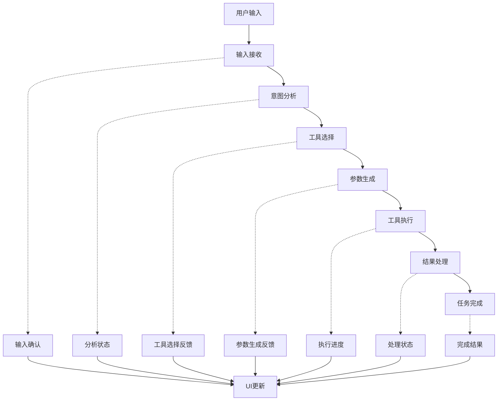

# 八爪鱼（Octopus）UI输出行为设计文档

## 文档信息

- **文档版本**: v1.0
- **创建日期**: 2026-03-27
- **作者**: 八爪鱼产品团队
- **文档类型**: 设计文档
- **适用范围**: 八爪鱼AI智能体UI输出行为规范

---

## 1. 文档概述

本文档定义了八爪鱼AI智能体从用户输入到任务完成的完整UI输出行为，包括：
- 用户输入处理流程
- 内部模块切换逻辑
- 流式输出机制
- 实时状态更新
- 最终任务完成的UI展示

本文档旨在为前端开发团队提供清晰的UI输出行为规范，确保用户在与八爪鱼交互过程中获得一致、流畅、直观的体验。

---

## 2. 总体流程

八爪鱼的UI输出行为从用户输入开始，经过内部处理，最终完成任务。整个流程包括以下阶段：



---

## 3. 详细流程设计

### 3.1 用户输入阶段

#### 3.1.1 输入接收

**UI行为**：
- 用户在输入框中输入文本
- 点击发送按钮或按Enter键提交
- 输入框变为不可编辑状态，显示加载指示器
- 输入内容显示在对话历史中，标记为"用户输入"

**输出格式**：
```json
{
  "event_type": "input_received",
  "timestamp": "2026-03-27T10:30:00Z",
  "session_id": "session_123",
  "data": {
    "content": "请生成python排序代码",
    "status": "submitted",
    "message": "正在处理您的请求..."
  }
}
```

### 3.2 意图分析阶段

#### 3.2.1 分析开始

**UI行为**：
- 显示"正在分析意图..."的状态消息
- 进度条显示20%进度
- 可选择显示AI的思考过程（可选）

**输出格式**：
```json
{
  "event_type": "intent_analysis",
  "timestamp": "2026-03-27T10:30:01Z",
  "session_id": "session_123",
  "data": {
    "stage": "intent_analysis",
    "status": "analyzing",
    "progress": 20,
    "message": "正在分析用户意图...",
    "details": {
      "user_input": "请生成python排序代码",
      "detected_intent": "code_generation",
      "confidence": 0.95
    }
  }
}
```

#### 3.2.2 分析完成

**UI行为**：
- 显示"意图分析完成"的状态消息
- 进度条保持20%进度，等待工具选择

**输出格式**：
```json
{
  "event_type": "intent_analysis",
  "timestamp": "2026-03-27T10:30:03Z",
  "session_id": "session_123",
  "data": {
    "stage": "intent_analysis",
    "status": "completed",
    "progress": 20,
    "message": "意图分析完成",
    "details": {
      "intent": "code_generation",
      "confidence": 0.95
    }
  }
}
```

### 3.3 工具选择阶段

#### 3.3.1 工具选择

**UI行为**：
- 显示"正在选择工具..."的状态消息
- 进度条显示30%进度
- 可显示正在评估的工具列表（可选）

**输出格式**：
```json
{
  "event_type": "tool_selection",
  "timestamp": "2026-03-27T10:30:04Z",
  "session_id": "session_123",
  "data": {
    "stage": "tool_selection",
    "status": "selecting",
    "progress": 30,
    "message": "正在选择合适的工具..."
  }
}
```

#### 3.3.2 工具选择完成

**UI行为**：
- 显示"已选择工具：工具名称"的状态消息
- 进度条显示40%进度
- 显示工具描述和置信度

**输出格式**：
```json
{
  "event_type": "tool_selection",
  "timestamp": "2026-03-27T10:30:05Z",
  "session_id": "session_123",
  "data": {
    "stage": "tool_selection",
    "status": "completed",
    "progress": 40,
    "message": "已选择工具: code_generator",
    "details": {
      "tool_name": "code_generator",
      "tool_description": "根据需求生成代码",
      "confidence": 0.92
    }
  }
}
```

### 3.4 参数生成阶段

#### 3.4.1 参数生成

**UI行为**：
- 显示"正在生成参数..."的状态消息
- 进度条保持40%进度
- 可显示参数生成过程（可选）

**输出格式**：
```json
{
  "event_type": "parameter_generation",
  "timestamp": "2026-03-27T10:30:06Z",
  "session_id": "session_123",
  "data": {
    "stage": "parameter_generation",
    "status": "generating",
    "progress": 40,
    "message": "正在生成工具参数..."
  }
}
```

#### 3.4.2 参数生成完成

**UI行为**：
- 显示"参数生成完成"的状态消息
- 进度条保持40%进度，等待工具执行
- 可显示生成的参数（可选，敏感参数需脱敏）

**输出格式**：
```json
{
  "event_type": "parameter_generation",
  "timestamp": "2026-03-27T10:30:07Z",
  "session_id": "session_123",
  "data": {
    "stage": "parameter_generation",
    "status": "completed",
    "progress": 40,
    "message": "参数生成完成",
    "details": {
      "parameters": {
        "language": "python",
        "task": "sorting algorithm"
      }
    }
  }
}
```

### 3.5 工具执行阶段

#### 3.5.1 执行开始

**UI行为**：
- 显示"正在执行工具..."的状态消息
- 进度条显示60%进度
- 可显示执行命令或操作（可选）

**输出格式**：
```json
{
  "event_type": "tool_execution",
  "timestamp": "2026-03-27T10:30:08Z",
  "session_id": "session_123",
  "data": {
    "stage": "tool_execution",
    "status": "executing",
    "progress": 60,
    "message": "正在执行工具...",
    "details": {
      "tool_name": "code_generator",
      "parameters": {
        "language": "python",
        "task": "sorting algorithm"
      }
    }
  }
}
```

#### 3.5.2 执行过程

**UI行为**：
- 显示执行过程的实时输出（如代码生成的部分内容）
- 进度条在60-80%之间动态更新
- 可显示执行时间（可选）

**输出格式**：
```json
{
  "event_type": "tool_execution",
  "timestamp": "2026-03-27T10:30:10Z",
  "session_id": "session_123",
  "data": {
    "stage": "tool_execution",
    "status": "executing",
    "progress": 70,
    "message": "执行中...",
    "details": {
      "output": "def bubble_sort(arr):\n    n = len(arr)\n    for i in range(n):\n        for j in range(0, n-i-1):",
      "execution_time": "2s"
    }
  }
}
```

#### 3.5.3 执行完成

**UI行为**：
- 显示"工具执行完成"的状态消息
- 进度条显示80%进度
- 可显示执行结果摘要（可选）

**输出格式**：
```json
{
  "event_type": "tool_execution",
  "timestamp": "2026-03-27T10:30:12Z",
  "session_id": "session_123",
  "data": {
    "stage": "tool_execution",
    "status": "completed",
    "progress": 80,
    "message": "工具执行完成",
    "details": {
      "execution_time": "4s",
      "output_length": "150 characters"
    }
  }
}
```

### 3.6 结果处理阶段

#### 3.6.1 结果处理

**UI行为**：
- 显示"正在处理结果..."的状态消息
- 进度条保持80%进度
- 可显示结果处理过程（可选）

**输出格式**：
```json
{
  "event_type": "result_processing",
  "timestamp": "2026-03-27T10:30:13Z",
  "session_id": "session_123",
  "data": {
    "stage": "result_processing",
    "status": "processing",
    "progress": 80,
    "message": "正在处理结果..."
  }
}
```

#### 3.6.2 结果处理完成

**UI行为**：
- 显示"结果处理完成"的状态消息
- 进度条保持80%进度，等待最终完成

**输出格式**：
```json
{
  "event_type": "result_processing",
  "timestamp": "2026-03-27T10:30:14Z",
  "session_id": "session_123",
  "data": {
    "stage": "result_processing",
    "status": "completed",
    "progress": 80,
    "message": "结果处理完成"
  }
}
```

### 3.7 任务完成阶段

#### 3.7.1 任务完成

**UI行为**：
- 显示"任务完成"的状态消息
- 进度条显示100%进度
- 显示最终结果（如生成的代码、分析报告等）
- 输入框恢复可编辑状态
- 可显示任务执行统计信息（可选）

**输出格式**：
```json
{
  "event_type": "completed",
  "timestamp": "2026-03-27T10:30:15Z",
  "session_id": "session_123",
  "data": {
    "stage": "completed",
    "status": "success",
    "progress": 100,
    "message": "任务完成",
    "result": {
      "content": "def bubble_sort(arr):\n    n = len(arr)\n    for i in range(n):\n        for j in range(0, n-i-1):\n            if arr[j] > arr[j+1]:\n                arr[j], arr[j+1] = arr[j+1], arr[j]\n    return arr\n\n# 示例使用\nprint(bubble_sort([64, 34, 25, 12, 22, 11, 90]))",
      "format": "code",
      "language": "python"
    },
    "statistics": {
      "total_time": "15s",
      "stages": [
        {"name": "intent_analysis", "time": "2s"},
        {"name": "tool_selection", "time": "1s"},
        {"name": "parameter_generation", "time": "1s"},
        {"name": "tool_execution", "time": "8s"},
        {"name": "result_processing", "time": "3s"}
      ]
    }
  }
}
```

---

## 4. 异常处理

### 4.1 错误类型

| 错误类型 | 描述 | 处理方式 |
|----------|------|----------|
| **意图识别失败** | 无法识别用户意图 | 显示错误消息，提供重试选项 |
| **工具选择失败** | 无法找到合适的工具 | 显示错误消息，提供替代方案 |
| **参数生成失败** | 无法生成有效参数 | 显示错误消息，请求用户提供更多信息 |
| **工具执行失败** | 工具执行出错 | 显示错误消息，提供重试选项 |
| **结果处理失败** | 结果处理出错 | 显示错误消息，提供重试选项 |
| **网络错误** | 网络连接问题 | 显示错误消息，提供重试选项 |
| **模型错误** | LLM模型错误 | 显示错误消息，提供重试选项 |

### 4.2 错误UI行为

**UI行为**：
- 显示错误图标和错误消息
- 进度条显示当前阶段进度
- 提供重试按钮
- 可显示错误详情（可选）

**输出格式**：
```json
{
  "event_type": "error",
  "timestamp": "2026-03-27T10:30:10Z",
  "session_id": "session_123",
  "data": {
    "stage": "tool_execution",
    "status": "error",
    "progress": 60,
    "message": "工具执行失败",
    "error": {
      "code": "EXECUTION_ERROR",
      "message": "代码生成工具执行超时",
      "details": "工具执行时间超过30秒",
      "retryable": true
    }
  }
}
```

### 4.3 重试机制

**UI行为**：
- 显示重试按钮
- 点击重试后，从失败阶段重新开始
- 显示重试进度

**输出格式**：
```json
{
  "event_type": "retry",
  "timestamp": "2026-03-27T10:30:12Z",
  "session_id": "session_123",
  "data": {
    "stage": "tool_execution",
    "status": "retrying",
    "progress": 60,
    "message": "正在重试..."
  }
}
```

---

## 5. 流式输出设计

### 5.1 流式输出类型

| 输出类型 | 描述 | 显示方式 |
|----------|------|----------|
| **文本流** | 连续的文本输出 | 逐字显示，模拟打字效果 |
| **代码流** | 代码生成输出 | 按行显示，语法高亮 |
| **思考流** | AI的思考过程 | 灰色文本，可折叠 |
| **进度流** | 执行进度更新 | 进度条更新，状态消息 |
| **事件流** | 系统事件通知 | 通知样式，自动消失 |

### 5.2 流式输出控制

**UI行为**：
- 支持暂停/继续流式输出
- 支持调整流式输出速度
- 支持直接显示完整结果
- 支持复制流式输出内容

**输出格式**：
```json
{
  "event_type": "stream",
  "timestamp": "2026-03-27T10:30:10Z",
  "session_id": "session_123",
  "data": {
    "type": "text",
    "content": "正在生成Python排序代码...",
    "stream_id": "stream_123",
    "is_final": false
  }
}
```

### 5.3 流式输出完成

**UI行为**：
- 流式输出完成后，显示完整内容
- 可显示"输出完成"的状态指示
- 提供复制、保存等操作选项

**输出格式**：
```json
{
  "event_type": "stream",
  "timestamp": "2026-03-27T10:30:15Z",
  "session_id": "session_123",
  "data": {
    "type": "text",
    "content": "Python排序代码生成完成",
    "stream_id": "stream_123",
    "is_final": true
  }
}
```

---

## 6. 内部模块切换逻辑

### 6.1 模块间通信

**模块切换流程**：
1. **接入服务** → **控制服务**：用户输入验证和路由
2. **控制服务** → **执行服务**：意图识别和任务规划
3. **执行服务** → **模型服务**：LLM调用和Function Calling
4. **执行服务** → **能力服务**：工具执行
5. **能力服务** → **执行服务**：执行结果反馈
6. **执行服务** → **控制服务**：任务状态更新
7. **控制服务** → **接入服务**：结果推送
8. **接入服务** → **实时输出服务**：实时状态推送

### 6.2 模块切换UI行为

**UI行为**：
- 模块切换时显示过渡动画（可选）
- 显示当前处理模块的名称（可选）
- 保持整体进度的连续性
- 确保状态消息的一致性

**输出格式**：
```json
{
  "event_type": "module_switch",
  "timestamp": "2026-03-27T10:30:05Z",
  "session_id": "session_123",
  "data": {
    "from_module": "execution_service",
    "to_module": "model_service",
    "action": "function_calling",
    "message": "正在调用模型服务进行Function Calling"
  }
}
```

---

## 7. UI组件设计

### 7.1 主要组件

#### 7.1.1 对话区域

**组件功能**：
- 显示用户输入和AI输出
- 支持流式输出显示
- 支持代码块语法高亮
- 支持消息时间戳
- 支持消息状态指示

**设计规范**：
- 用户消息：右对齐，浅蓝色背景
- AI消息：左对齐，浅灰色背景
- 系统消息：居中对齐，浅黄色背景
- 错误消息：左对齐，浅红色背景

#### 7.1.2 输入区域

**组件功能**：
- 文本输入框
- 发送按钮
- 表情选择器（可选）
- 附件上传（可选）
- 语音输入（可选）

**设计规范**：
- 输入框高度：40px
- 发送按钮：圆形，40px直径
- 支持Enter键发送
- 支持Shift+Enter换行
- 输入中显示字数统计

#### 7.1.3 进度区域

**组件功能**：
- 进度条
- 状态消息
- 阶段指示器
- 执行时间显示

**设计规范**：
- 进度条高度：8px
- 进度条颜色：蓝色渐变
- 状态消息字体：14px
- 阶段指示器：小型图标

#### 7.1.4 控制面板

**组件功能**：
- 流式输出控制（暂停/继续）
- 速度调节
- 复制按钮
- 重试按钮
- 取消按钮

**设计规范**：
- 按钮大小：32px
- 图标大小：16px
- 间距：8px
- 悬停效果：轻微放大

### 7.2 响应式设计

**设计规范**：
- 桌面端：完整功能，三栏布局
- 平板端：双栏布局，控制面板可折叠
- 移动端：单栏布局，控制面板通过底部菜单访问
- 最小宽度：320px
- 最大宽度：1200px

---

## 8. 交互设计

### 8.1 用户交互

**交互规范**：
- 点击发送按钮：提交输入
- 按Enter键：提交输入
- 按Shift+Enter：换行
- 点击重试按钮：重新执行失败的任务
- 点击取消按钮：取消当前任务
- 点击复制按钮：复制输出内容
- 点击代码块：显示复制按钮
- 悬停在消息上：显示时间戳和操作选项

### 8.2 反馈机制

**反馈规范**：
- 输入提交：显示加载指示器
- 任务执行：显示进度条和状态消息
- 错误发生：显示错误消息和重试按钮
- 任务完成：显示完成消息和结果
- 操作成功：显示成功提示
- 操作失败：显示失败提示

### 8.3 无障碍设计

**设计规范**：
- 支持键盘导航
- 支持屏幕阅读器
- 提供足够的颜色对比度
- 支持放大功能
- 提供文本替代方案

---

## 9. 性能优化

### 9.1 前端优化

**优化策略**：
- 使用虚拟滚动处理长对话
- 延迟加载历史消息
- 缓存常用工具的参数
- 优化WebSocket连接
- 减少DOM操作
- 使用Web Workers处理复杂计算

### 9.2 后端优化

**优化策略**：
- 流式输出分块处理
- 压缩传输数据
- 缓存模型响应
- 优化数据库查询
- 使用连接池管理数据库连接
- 实现请求批处理

### 9.3 网络优化

**优化策略**：
- 使用WebSocket进行实时通信
- 实现断点续传
- 优化API响应时间
- 使用CDN加速静态资源
- 实现请求重试机制
- 监控网络状态

---

## 10. 实现指南

### 10.1 前端实现

#### 10.1.1 技术栈

- **框架**：Vue 3 + Vite
- **UI库**：Element Plus
- **状态管理**：Pinia
- **HTTP客户端**：Axios
- **WebSocket**：原生WebSocket API
- **样式**：SCSS
- **构建工具**：Vite

#### 10.1.2 核心组件

**ChatContainer.vue**：
- 对话区域容器
- 消息列表管理
- 滚动控制

**MessageItem.vue**：
- 单条消息显示
- 支持不同类型消息
- 交互处理

**InputArea.vue**：
- 输入框组件
- 发送逻辑
- 附件处理

**ProgressBar.vue**：
- 进度条组件
- 状态消息显示
- 阶段指示

**ControlPanel.vue**：
- 控制面板组件
- 流式输出控制
- 操作按钮

#### 10.1.3 状态管理

**store/chat.ts**：
```typescript
interface ChatState {
  messages: Message[];
  currentSession: string;
  isLoading: boolean;
  currentStage: string;
  progress: number;
  statusMessage: string;
  error: Error | null;
  streamId: string | null;
  isStreaming: boolean;
}
```

### 10.2 后端实现

#### 10.2.1 技术栈

- **框架**：FastAPI
- **WebSocket**：FastAPI WebSocket
- **消息队列**：Redis
- **数据库**：PostgreSQL
- **缓存**：Redis
- **部署**：Docker

#### 10.2.2 核心服务

**RealtimeService**：
- WebSocket连接管理
- 事件分发
- 会话管理

**ExecutionService**：
- 意图识别
- 工具选择
- 任务执行

**ModelService**：
- LLM调用
- Function Calling
- 流式输出

#### 10.2.3 API设计

**WebSocket API**：
```
ws://localhost:8000/ws/{session_id}
```

**事件格式**：
```json
{
  "event_type": "string",
  "timestamp": "string",
  "session_id": "string",
  "data": {}
}
```

---

## 11. 测试指南

### 11.1 功能测试

**测试场景**：
- 正常流程测试
- 错误处理测试
- 重试机制测试
- 流式输出测试
- 多轮对话测试
- 不同类型工具测试

**测试工具**：
- Jest（单元测试）
- Cypress（端到端测试）
- Postman（API测试）

### 11.2 性能测试

**测试指标**：
- 响应时间
- 流式输出延迟
- 内存使用
- CPU使用
- 网络传输量

**测试工具**：
- Lighthouse
- WebPageTest
- JMeter

### 11.3 兼容性测试

**测试环境**：
- 主流浏览器（Chrome, Firefox, Safari, Edge）
- 不同设备（桌面, 平板, 手机）
- 不同网络环境（4G, 5G, WiFi）

**测试工具**：
- BrowserStack
- LambdaTest

---

## 12. 部署指南

### 12.1 前端部署

**部署步骤**：
1. 构建前端应用：`npm run build`
2. 部署到静态文件服务器
3. 配置CDN加速
4. 配置HTTPS

**环境变量**：
- `VITE_API_URL`：API地址
- `VITE_WS_URL`：WebSocket地址
- `VITE_APP_ENV`：环境（development/production）

### 12.2 后端部署

**部署步骤**：
1. 构建Docker镜像
2. 部署到容器平台
3. 配置负载均衡
4. 配置监控

**环境变量**：
- `API_KEY`：LLM API密钥
- `DATABASE_URL`：数据库连接字符串
- `REDIS_URL`：Redis连接字符串
- `HOST`：服务主机
- `PORT`：服务端口

---

## 13. 监控与日志

### 13.1 前端监控

**监控指标**：
- 页面加载时间
- 交互响应时间
- 错误率
- 用户行为
- 设备信息

**监控工具**：
- Google Analytics
- Sentry
- LogRocket

### 13.2 后端监控

**监控指标**：
- API响应时间
- 错误率
- 吞吐量
- 资源使用
- WebSocket连接数

**监控工具**：
- Prometheus
- Grafana
- ELK Stack

### 13.3 日志管理

**日志级别**：
- DEBUG
- INFO
- WARNING
- ERROR
- CRITICAL

**日志格式**：
```json
{
  "timestamp": "2026-03-27T10:30:00Z",
  "level": "INFO",
  "service": "frontend",
  "component": "ChatContainer",
  "message": "User input received",
  "data": {
    "session_id": "session_123",
    "input": "请生成python排序代码"
  }
}
```

---

## 14. 结论与建议

### 14.1 核心结论

1. **统一的UI输出行为规范**：本文档定义了从用户输入到任务完成的完整UI输出行为，确保了用户体验的一致性和流畅性。

2. **实时反馈机制**：通过流式输出和实时状态更新，用户可以清楚地看到任务的执行过程，减少等待焦虑。

3. **模块化设计**：基于微服务架构，各模块间职责明确，通信规范，确保了系统的可扩展性和可维护性。

4. **异常处理**：完善的错误处理和重试机制，提高了系统的可靠性和用户体验。

5. **性能优化**：前端和后端的性能优化策略，确保了系统的响应速度和稳定性。

### 14.2 实施建议

1. **分阶段实施**：
   - 第一阶段：实现核心UI组件和基本流程
   - 第二阶段：实现流式输出和实时状态更新
   - 第三阶段：实现错误处理和重试机制
   - 第四阶段：实现性能优化和监控

2. **优先级建议**：
   - 高优先级：基本对话流程、流式输出、错误处理
   - 中优先级：实时状态更新、响应式设计、性能优化
   - 低优先级：高级交互功能、无障碍设计、高级监控

3. **测试建议**：
   - 建立完整的测试用例
   - 进行端到端测试
   - 进行性能测试
   - 进行兼容性测试

4. **监控建议**：
   - 建立完善的监控体系
   - 设置合理的告警阈值
   - 定期分析监控数据
   - 持续优化系统性能

### 14.3 未来扩展

1. **功能扩展**：
   - 支持更多输入方式（语音、图像）
   - 支持更多输出格式（图表、表格）
   - 支持多语言界面
   - 支持主题切换

2. **性能优化**：
   - 使用WebAssembly加速前端计算
   - 实现智能缓存策略
   - 优化WebSocket连接管理
   - 实现边缘计算

3. **用户体验**：
   - 实现个性化推荐
   - 支持用户自定义界面
   - 提供更多交互方式
   - 实现智能提示

---

## 15. 附录

### 15.1 事件类型列表

| 事件类型 | 描述 | 阶段 |
|----------|------|------|
| `input_received` | 接收用户输入 | 输入阶段 |
| `intent_analysis` | 意图分析 | 分析阶段 |
| `tool_selection` | 工具选择 | 工具选择阶段 |
| `parameter_generation` | 参数生成 | 参数生成阶段 |
| `tool_execution` | 工具执行 | 执行阶段 |
| `result_processing` | 结果处理 | 处理阶段 |
| `completed` | 任务完成 | 完成阶段 |
| `error` | 错误发生 | 全阶段 |
| `retry` | 重试操作 | 全阶段 |
| `stream` | 流式输出 | 全阶段 |
| `module_switch` | 模块切换 | 全阶段 |

### 15.2 状态码列表

| 状态码 | 描述 | 类型 |
|--------|------|------|
| `submitted` | 输入已提交 | 输入阶段 |
| `analyzing` | 正在分析 | 分析阶段 |
| `selecting` | 正在选择工具 | 工具选择阶段 |
| `generating` | 正在生成参数 | 参数生成阶段 |
| `executing` | 正在执行 | 执行阶段 |
| `processing` | 正在处理 | 处理阶段 |
| `completed` | 完成 | 全阶段 |
| `error` | 错误 | 全阶段 |
| `retrying` | 正在重试 | 全阶段 |
| `success` | 成功 | 完成阶段 |

### 15.3 示例代码

#### 前端WebSocket处理

```javascript
// WebSocket连接管理
class WebSocketManager {
  constructor(url) {
    this.url = url;
    this.socket = null;
    this.listeners = new Map();
  }

  connect(sessionId) {
    this.socket = new WebSocket(`${this.url}/${sessionId}`);
    
    this.socket.onopen = () => {
      console.log('WebSocket connected');
    };
    
    this.socket.onmessage = (event) => {
      const data = JSON.parse(event.data);
      this._notifyListeners(data.event_type, data);
    };
    
    this.socket.onclose = () => {
      console.log('WebSocket disconnected');
    };
    
    this.socket.onerror = (error) => {
      console.error('WebSocket error:', error);
    };
  }

  on(eventType, callback) {
    if (!this.listeners.has(eventType)) {
      this.listeners.set(eventType, []);
    }
    this.listeners.get(eventType).push(callback);
  }

  _notifyListeners(eventType, data) {
    if (this.listeners.has(eventType)) {
      this.listeners.get(eventType).forEach(callback => {
        callback(data);
      });
    }
  }

  send(data) {
    if (this.socket && this.socket.readyState === WebSocket.OPEN) {
      this.socket.send(JSON.stringify(data));
    }
  }

  disconnect() {
    if (this.socket) {
      this.socket.close();
    }
  }
}

// 使用示例
const wsManager = new WebSocketManager('ws://localhost:8000/ws');
wsManager.connect('session_123');

// 监听事件
wsManager.on('input_received', (data) => {
  console.log('Input received:', data);
  // 更新UI
});

wsManager.on('intent_analysis', (data) => {
  console.log('Intent analysis:', data);
  // 更新UI
});

wsManager.on('completed', (data) => {
  console.log('Task completed:', data);
  // 更新UI
});

wsManager.on('error', (data) => {
  console.error('Error:', data);
  // 更新UI
});

// 发送消息
wsManager.send({
  type: 'message',
  content: '请生成python排序代码'
});
```

#### 后端WebSocket处理

```python
# FastAPI WebSocket端点
from fastapi import FastAPI, WebSocket, WebSocketDisconnect
from typing import Dict, Any

app = FastAPI()

class ConnectionManager:
    def __init__(self):
        self.active_connections: Dict[str, WebSocket] = {}

    async def connect(self, websocket: WebSocket, session_id: str):
        await websocket.accept()
        self.active_connections[session_id] = websocket

    def disconnect(self, session_id: str):
        if session_id in self.active_connections:
            del self.active_connections[session_id]

    async def send_personal_message(self, message: Dict[str, Any], session_id: str):
        if session_id in self.active_connections:
            await self.active_connections[session_id].send_json(message)

manager = ConnectionManager()

@app.websocket("/ws/{session_id}")
async def websocket_endpoint(websocket: WebSocket, session_id: str):
    await manager.connect(websocket, session_id)
    try:
        while True:
            data = await websocket.receive_json()
            # 处理用户输入
            await process_user_input(data, session_id, manager)
    except WebSocketDisconnect:
        manager.disconnect(session_id)

async def process_user_input(data: Dict[str, Any], session_id: str, manager: ConnectionManager):
    # 模拟处理流程
    
    # 1. 输入接收
    await manager.send_personal_message({
        "event_type": "input_received",
        "timestamp": "2026-03-27T10:30:00Z",
        "session_id": session_id,
        "data": {
            "content": data.get("content"),
            "status": "submitted",
            "message": "正在处理您的请求..."
        }
    }, session_id)
    
    # 2. 意图分析
    await manager.send_personal_message({
        "event_type": "intent_analysis",
        "timestamp": "2026-03-27T10:30:01Z",
        "session_id": session_id,
        "data": {
            "stage": "intent_analysis",
            "status": "analyzing",
            "progress": 20,
            "message": "正在分析用户意图..."
        }
    }, session_id)
    
    # 3. 工具选择
    await manager.send_personal_message({
        "event_type": "tool_selection",
        "timestamp": "2026-03-27T10:30:03Z",
        "session_id": session_id,
        "data": {
            "stage": "tool_selection",
            "status": "completed",
            "progress": 40,
            "message": "已选择工具: code_generator"
        }
    }, session_id)
    
    # 4. 工具执行
    await manager.send_personal_message({
        "event_type": "tool_execution",
        "timestamp": "2026-03-27T10:30:05Z",
        "session_id": session_id,
        "data": {
            "stage": "tool_execution",
            "status": "executing",
            "progress": 60,
            "message": "正在执行工具..."
        }
    }, session_id)
    
    # 5. 任务完成
    await manager.send_personal_message({
        "event_type": "completed",
        "timestamp": "2026-03-27T10:30:10Z",
        "session_id": session_id,
        "data": {
            "stage": "completed",
            "status": "success",
            "progress": 100,
            "message": "任务完成",
            "result": {
                "content": "def bubble_sort(arr):\n    n = len(arr)\n    for i in range(n):\n        for j in range(0, n-i-1):\n            if arr[j] > arr[j+1]:\n                arr[j], arr[j+1] = arr[j+1], arr[j]\n    return arr",
                "format": "code",
                "language": "python"
            }
        }
    }, session_id)
```

---

**文档结束**

**变更历史**:
- v1.0 (2026-03-27): 初始版本
