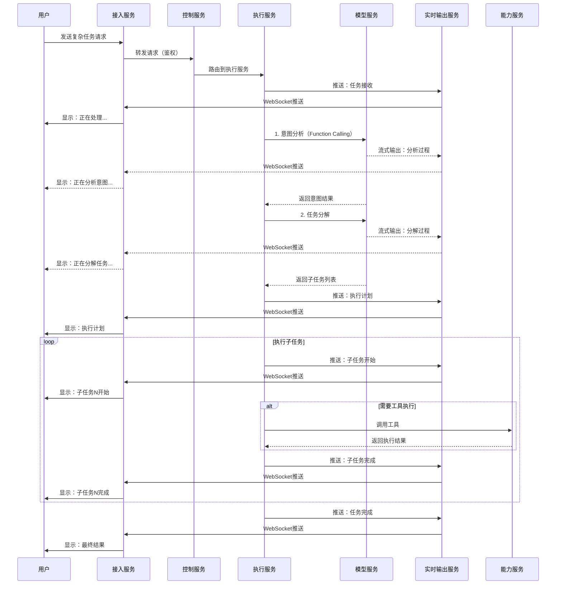

# 八爪鱼（Octopus）多子任务分解架构优化方案

## 文档信息

- **文档版本**: v1.0
- **创建日期**: 2026-03-27
- **作者**: 八爪鱼产品团队
- **文档类型**: 架构设计文档
- **适用范围**: 八爪鱼AI智能体多子任务分解与执行架构优化

---

## 1. 文档概述

本文档基于八爪鱼微服务架构，结合意图识别技术竞争分析和UI输出行为设计，提出多子任务分解的最佳架构优化和实现方案。

**参考文档**：
- [架构设计.md](./架构设计.md) - 微服务架构定义
- [意图识别技术竞争分析.md](./意图识别技术竞争分析.md) - LLM Function Calling方案
- [UI输出行为设计文档.md](./UI输出行为设计文档.md) - UI输出行为规范
- [多子任务分解设计文档.md](./多子任务分解设计文档.md) - 任务分解策略

---

## 2. 架构设计原则

### 2.1 核心原则

| 原则 | 说明 | 实现方式 |
|------|------|----------|
| **微服务解耦** | 各服务职责单一，通过标准接口通信 | REST API + gRPC + 消息队列 |
| **模块化设计** | 功能模块化，便于独立开发、测试和部署 | 清晰的模块边界和接口定义 |
| **单一职责** | 每个服务只负责一个核心功能 | 服务职责矩阵明确划分 |
| **高内聚低耦合** | 服务内部功能高度相关，服务间依赖最小化 | 依赖注入 + 接口抽象 |
| **可扩展性** | 支持水平扩展和功能扩展 | 插件化架构 + 配置驱动 |
| **容错性** | 服务故障不影响整体系统运行 | 熔断机制 + 降级策略 |

### 2.2 服务边界划分

```
┌─────────────────────────────────────────────────────────────────┐
│                        用户输入层                                │
│  ┌─────────────┐  ┌─────────────┐  ┌─────────────┐             │
│  │  Web界面    │  │  命令行     │  │  API接口    │             │
│  └──────┬──────┘  └──────┬──────┘  └──────┬──────┘             │
└─────────┼────────────────┼────────────────┼─────────────────────┘
          │                │                │
          └────────────────┴────────────────┘
                           │
┌──────────────────────────▼──────────────────────────────────────┐
│                      接入服务 (Access Service)                   │
│  - 多渠道接入统一                                                │
│  - 消息格式转换                                                  │
│  - WebSocket连接管理                                             │
└──────────────────────────┬──────────────────────────────────────┘
                           │
┌──────────────────────────▼──────────────────────────────────────┐
│                      控制服务 (Control Service)                  │
│  - 鉴权验证                                                      │
│  - 路由管理                                                      │
│  - 会话管理                                                      │
└──────────────────────────┬──────────────────────────────────────┘
                           │
┌──────────────────────────▼──────────────────────────────────────┐
│                      执行服务 (Execution Service)                │
│  ┌─────────────────┐  ┌─────────────────┐  ┌─────────────────┐  │
│  │  意图理解模块   │  │  任务规划模块   │  │  ReAct引擎      │  │
│  │  (Intent)       │  │  (Planning)     │  │  (Execution)    │  │
│  └────────┬────────┘  └────────┬────────┘  └────────┬────────┘  │
│           │                    │                    │           │
│           └────────────────────┴────────────────────┘           │
│                                │                                │
└────────────────────────────────┼────────────────────────────────┘
                                 │
        ┌────────────────────────┼────────────────────────┐
        │                        │                        │
┌───────▼────────┐    ┌──────────▼──────────┐  ┌─────────▼─────────┐
│   模型服务      │    │     能力服务         │  │   实时输出服务    │
│ (Model Service) │    │ (Capability Service) │  │ (Realtime Service)│
│  - Function     │    │  - 技能管理          │  │  - WebSocket管理  │
│    Calling      │    │  - 工具执行          │  │  - 消息分发       │
│  - 流式输出     │    │  - 沙箱环境          │  │  - 流式API        │
└─────────────────┘    └─────────────────────┘  └───────────────────┘
```

---

## 3. 核心服务设计

### 3.1 执行服务（Execution Service）- 核心编排

**职责**：任务分解、意图理解、ReAct循环执行

**模块划分**：

```python
# services/execution/
execution/
├── __init__.py
├── app.py                      # FastAPI应用入口
├── config.py                   # 配置管理
├── modules/                    # 核心模块
│   ├── __init__.py
│   ├── intent/                 # 意图理解模块
│   │   ├── __init__.py
│   │   ├── analyzer.py         # 意图分析器
│   │   ├── entity_extractor.py # 实体提取器
│   │   └── context_manager.py  # 上下文管理
│   ├── planning/               # 任务规划模块
│   │   ├── __init__.py
│   │   ├── decomposer.py       # 任务分解器
│   │   ├── dependency_manager.py # 依赖管理器
│   │   └── execution_planner.py  # 执行计划生成器
│   ├── react/                  # ReAct引擎
│   │   ├── __init__.py
│   │   ├── engine.py           # ReAct引擎核心
│   │   ├── thought_generator.py # 思考生成器
│   │   ├── action_executor.py  # 行动执行器
│   │   └── observer.py         # 观察器
│   └── state/                  # 状态管理
│       ├── __init__.py
│       ├── task_state.py       # 任务状态
│       └── session_state.py    # 会话状态
├── clients/                    # 服务客户端
│   ├── __init__.py
│   ├── model_client.py         # 模型服务客户端
│   ├── capability_client.py    # 能力服务客户端
│   └── realtime_client.py      # 实时输出服务客户端
└── models/                     # 数据模型
    ├── __init__.py
    ├── task.py                 # 任务模型
    ├── intent.py               # 意图模型
    └── execution.py            # 执行模型
```

**核心实现**：

```python
# services/execution/modules/planning/decomposer.py
class TaskDecomposer:
    """
    任务分解器 - 负责将复杂任务分解为可执行的子任务
    
    职责：
    1. 判断是否为多子任务场景
    2. 生成子任务列表
    3. 分析子任务依赖关系
    4. 生成执行计划
    """
    
    def __init__(
        self,
        model_client: ModelClient,
        realtime_client: RealtimeClient
    ):
        self.model_client = model_client
        self.realtime_client = realtime_client
    
    async def decompose(
        self,
        user_input: str,
        context: dict,
        session_id: str
    ) -> DecompositionResult:
        """
        分解任务
        
        Args:
            user_input: 用户输入
            context: 上下文信息
            session_id: 会话ID
            
        Returns:
            DecompositionResult: 分解结果
        """
        # 1. 推送任务分解开始事件
        await self._notify_decomposition_started(session_id)
        
        # 2. 意图分析
        intent_result = await self._analyze_intent(user_input, context, session_id)
        
        # 3. 判断是否为多子任务
        if not self._is_multi_task(intent_result):
            # 单子任务，直接返回
            return DecompositionResult(
                is_multi_task=False,
                subtasks=[],
                execution_plan=None
            )
        
        # 4. 生成子任务列表
        subtasks = await self._generate_subtasks(
            user_input, intent_result, context, session_id
        )
        
        # 5. 分析依赖关系
        subtasks = self._analyze_dependencies(subtasks)
        
        # 6. 生成执行计划
        execution_plan = self._generate_execution_plan(subtasks)
        
        # 7. 推送任务分解完成事件
        await self._notify_decomposition_completed(session_id, subtasks, execution_plan)
        
        return DecompositionResult(
            is_multi_task=True,
            subtasks=subtasks,
            execution_plan=execution_plan
        )
    
    async def _analyze_intent(
        self,
        user_input: str,
        context: dict,
        session_id: str
    ) -> IntentResult:
        """分析用户意图"""
        # 调用模型服务进行意图分析
        request = {
            "messages": [
                {"role": "system", "content": "你是一个任务分析专家"},
                {"role": "user", "content": user_input}
            ],
            "tools": [self._get_intent_analysis_tool()],
            "stream": True
        }
        
        # 推送意图分析开始事件
        await self.realtime_client.push_event(session_id, {
            "event_type": "intent_analysis",
            "data": {"stage": "intent_analysis", "status": "analyzing", "progress": 10}
        })
        
        response = await self.model_client.chat_completion(request)
        
        # 推送意图分析完成事件
        await self.realtime_client.push_event(session_id, {
            "event_type": "intent_analysis",
            "data": {"stage": "intent_analysis", "status": "completed", "progress": 20}
        })
        
        return IntentResult.from_response(response)
    
    async def _generate_subtasks(
        self,
        user_input: str,
        intent_result: IntentResult,
        context: dict,
        session_id: str
    ) -> List[SubTask]:
        """生成子任务列表"""
        # 推送子任务生成开始事件
        await self.realtime_client.push_event(session_id, {
            "event_type": "subtask_generation",
            "data": {"stage": "subtask_generation", "status": "generating", "progress": 25}
        })
        
        # 调用模型服务生成子任务
        request = {
            "messages": [
                {"role": "system", "content": "你是一个任务分解专家"},
                {"role": "user", "content": f"将以下任务分解为子任务：{user_input}"}
            ],
            "tools": [self._get_task_decomposition_tool()],
            "stream": False
        }
        
        response = await self.model_client.chat_completion(request)
        subtasks_data = response.get("function_call", {}).get("arguments", {}).get("subtasks", [])
        
        subtasks = []
        for i, task_data in enumerate(subtasks_data):
            subtasks.append(SubTask(
                task_id=f"task_{i+1}",
                description=task_data.get("description"),
                required_tools=task_data.get("required_tools", []),
                dependencies=[],
                estimated_time=task_data.get("estimated_time"),
                priority=task_data.get("priority", 5),
                status=TaskStatus.PENDING
            ))
        
        # 推送子任务生成完成事件
        await self.realtime_client.push_event(session_id, {
            "event_type": "subtask_generation",
            "data": {
                "stage": "subtask_generation",
                "status": "completed",
                "progress": 30,
                "subtask_count": len(subtasks)
            }
        })
        
        return subtasks
```

### 3.2 模型服务（Model Service）- 统一模型接口

**职责**：提供统一的LLM调用接口，支持Function Calling和流式输出

**模块划分**：

```python
# services/model/
model/
├── __init__.py
├── app.py                      # FastAPI应用入口
├── config.py                   # 配置管理
├── modules/                    # 核心模块
│   ├── __init__.py
│   ├── integration/            # 模型集成
│   │   ├── __init__.py
│   │   ├── openai_adapter.py   # OpenAI适配器
│   │   ├── anthropic_adapter.py # Anthropic适配器
│   │   ├── google_adapter.py   # Google适配器
│   │   └── ollama_adapter.py   # Ollama适配器
│   ├── call/                   # 模型调用
│   │   ├── __init__.py
│   │   ├── function_calling.py # Function Calling实现
│   │   ├── streaming.py        # 流式输出处理
│   │   └── retry.py            # 重试机制
│   └── monitor/                # 模型监控
│       ├── __init__.py
│       ├── metrics.py          # 指标收集
│       └── logging.py          # 日志记录
└── clients/                    # 外部客户端
    └── __init__.py
```

**核心实现**：

```python
# services/model/modules/call/function_calling.py
class FunctionCallingService:
    """
    Function Calling服务 - 统一的Function Calling接口
    
    职责：
    1. 提供统一的Function Calling接口
    2. 支持流式输出
    3. 处理模型选择和切换
    4. 实现重试和错误处理
    """
    
    def __init__(
        self,
        model_registry: ModelRegistry,
        realtime_client: RealtimeClient
    ):
        self.model_registry = model_registry
        self.realtime_client = realtime_client
    
    async def chat_completion(
        self,
        request: ChatCompletionRequest,
        session_id: str
    ) -> AsyncIterator[ChatCompletionChunk]:
        """
        统一的聊天完成接口
        
        Args:
            request: 聊天完成请求
            session_id: 会话ID
            
        Yields:
            ChatCompletionChunk: 聊天完成块
        """
        # 1. 选择模型
        model = self._select_model(request)
        
        # 2. 推送模型调用开始事件
        await self._notify_model_call_started(session_id, model.name)
        
        try:
            # 3. 调用模型
            async for chunk in model.chat_completion(request):
                # 4. 处理流式输出
                if request.stream:
                    await self._handle_streaming_chunk(session_id, chunk)
                yield chunk
            
            # 5. 推送模型调用完成事件
            await self._notify_model_call_completed(session_id)
            
        except Exception as e:
            # 6. 错误处理
            await self._handle_model_error(session_id, e)
            raise
    
    async def function_call(
        self,
        messages: List[Message],
        tools: List[Tool],
        session_id: str
    ) -> FunctionCallResult:
        """
        Function Calling接口
        
        Args:
            messages: 消息列表
            tools: 工具列表
            session_id: 会话ID
            
        Returns:
            FunctionCallResult: Function Calling结果
        """
        request = ChatCompletionRequest(
            messages=messages,
            tools=tools,
            stream=True
        )
        
        # 收集完整的响应
        full_response = []
        async for chunk in self.chat_completion(request, session_id):
            full_response.append(chunk)
        
        # 解析Function Calling结果
        return self._parse_function_call_result(full_response)
    
    def _select_model(self, request: ChatCompletionRequest) -> ModelAdapter:
        """选择模型"""
        # 根据请求参数选择最合适的模型
        if request.requires_function_calling:
            return self.model_registry.get_model_with_function_calling()
        elif request.requires_streaming:
            return self.model_registry.get_model_with_streaming()
        else:
            return self.model_registry.get_default_model()
```

### 3.3 实时输出服务（Realtime Service）- 消息分发中心

**职责**：WebSocket连接管理、流式API管理、消息分发

**模块划分**：

```python
# services/realtime/
realtime/
├── __init__.py
├── app.py                      # FastAPI应用入口
├── config.py                   # 配置管理
├── modules/                    # 核心模块
│   ├── __init__.py
│   ├── websocket/              # WebSocket管理
│   │   ├── __init__.py
│   │   ├── manager.py          # WebSocket连接管理器
│   │   └── handler.py          # WebSocket消息处理器
│   ├── streaming/              # 流式API管理
│   │   ├── __init__.py
│   │   ├── buffer.py           # 流式数据缓冲区
│   │   └── aggregator.py       # 流式数据聚合器
│   └── broker/                 # 消息broker
│       ├── __init__.py
│       ├── redis_broker.py     # Redis消息broker
│       └── kafka_broker.py     # Kafka消息broker
└── models/                     # 数据模型
    ├── __init__.py
    ├── event.py                # 事件模型
    └── session.py              # 会话模型
```

**核心实现**：

```python
# services/realtime/modules/websocket/manager.py
class WebSocketManager:
    """
    WebSocket连接管理器
    
    职责：
    1. 管理WebSocket连接
    2. 会话与连接的映射
    3. 消息推送
    4. 连接状态监控
    """
    
    def __init__(self):
        # 会话ID到WebSocket连接的映射
        self.connections: Dict[str, WebSocket] = {}
        # 会话ID到订阅主题的映射
        self.subscriptions: Dict[str, Set[str]] = {}
    
    async def connect(self, session_id: str, websocket: WebSocket):
        """
        建立WebSocket连接
        
        Args:
            session_id: 会话ID
            websocket: WebSocket连接
        """
        await websocket.accept()
        self.connections[session_id] = websocket
        self.subscriptions[session_id] = set()
        
        logger.info(f"WebSocket connected: {session_id}")
    
    async def disconnect(self, session_id: str):
        """
        断开WebSocket连接
        
        Args:
            session_id: 会话ID
        """
        if session_id in self.connections:
            del self.connections[session_id]
        
        if session_id in self.subscriptions:
            del self.subscriptions[session_id]
        
        logger.info(f"WebSocket disconnected: {session_id}")
    
    async def send_event(self, session_id: str, event: Event):
        """
        发送事件到指定会话
        
        Args:
            session_id: 会话ID
            event: 事件
        """
        if session_id not in self.connections:
            logger.warning(f"No WebSocket connection for session: {session_id}")
            return
        
        websocket = self.connections[session_id]
        
        try:
            await websocket.send_json(event.to_dict())
        except Exception as e:
            logger.error(f"Failed to send event to {session_id}: {e}")
            # 连接可能已断开，清理连接
            await self.disconnect(session_id)
    
    async def broadcast_event(self, event: Event, session_ids: List[str] = None):
        """
        广播事件到多个会话
        
        Args:
            event: 事件
            session_ids: 会话ID列表，如果为None则广播到所有会话
        """
        if session_ids is None:
            session_ids = list(self.connections.keys())
        
        # 并行发送
        tasks = [self.send_event(session_id, event) for session_id in session_ids]
        await asyncio.gather(*tasks, return_exceptions=True)


# services/realtime/modules/broker/redis_broker.py
class RedisEventBroker:
    """
    Redis事件Broker
    
    职责：
    1. 事件的发布和订阅
    2. 消息队列管理
    3. 事件持久化
    """
    
    def __init__(self, redis_client: Redis):
        self.redis = redis_client
        self.subscribers: Dict[str, List[Callable]] = {}
    
    async def publish(self, channel: str, event: Event):
        """
        发布事件到指定频道
        
        Args:
            channel: 频道名称
            event: 事件
        """
        await self.redis.publish(channel, json.dumps(event.to_dict()))
    
    async def subscribe(self, channel: str, callback: Callable):
        """
        订阅频道
        
        Args:
            channel: 频道名称
            callback: 回调函数
        """
        if channel not in self.subscribers:
            self.subscribers[channel] = []
        
        self.subscribers[channel].append(callback)
        
        # 启动订阅任务
        asyncio.create_task(self._subscribe_task(channel))
    
    async def _subscribe_task(self, channel: str):
        """订阅任务"""
        pubsub = self.redis.pubsub()
        await pubsub.subscribe(channel)
        
        async for message in pubsub.listen():
            if message["type"] == "message":
                event_data = json.loads(message["data"])
                event = Event.from_dict(event_data)
                
                # 调用所有订阅者的回调
                for callback in self.subscribers.get(channel, []):
                    try:
                        await callback(event)
                    except Exception as e:
                        logger.error(f"Error in subscriber callback: {e}")
```

### 3.4 能力服务（Capability Service）- 工具执行

**职责**：技能管理、工具执行、沙箱环境

**模块划分**：

```python
# services/capability/
capability/
├── __init__.py
├── app.py                      # FastAPI应用入口
├── config.py                   # 配置管理
├── modules/                    # 核心模块
│   ├── __init__.py
│   ├── skill/                  # 技能管理
│   │   ├── __init__.py
│   │   ├── registry.py         # 技能注册表
│   │   ├── loader.py           # 技能加载器
│   │   └── validator.py        # 技能验证器
│   ├── executor/               # 工具执行
│   │   ├── __init__.py
│   │   ├── engine.py           # 执行引擎
│   │   ├── scheduler.py        # 任务调度器
│   │   └── result_handler.py   # 结果处理器
│   └── sandbox/                # 沙箱环境
│       ├── __init__.py
│       ├── docker_sandbox.py   # Docker沙箱
│       └── process_sandbox.py  # 进程沙箱
└── external/                   # 外部工具和插件
    ├── tools/                  # 外部工具
    │   ├── builtin/            # 内置工具
    │   └── community/          # 社区工具
    └── plugins/                # 行业插件
        ├── builtin/            # 内置插件
        └── community/          # 社区插件
```

**核心实现**：

```python
# services/capability/modules/executor/engine.py
class ToolExecutionEngine:
    """
    工具执行引擎
    
    职责：
    1. 执行工具调用
    2. 管理工具生命周期
    3. 处理执行结果
    4. 错误处理和重试
    """
    
    def __init__(
        self,
        skill_registry: SkillRegistry,
        sandbox_manager: SandboxManager,
        realtime_client: RealtimeClient
    ):
        self.skill_registry = skill_registry
        self.sandbox_manager = sandbox_manager
        self.realtime_client = realtime_client
    
    async def execute_tool(
        self,
        tool_name: str,
        parameters: dict,
        session_id: str,
        task_id: str = None
    ) -> ToolExecutionResult:
        """
        执行工具
        
        Args:
            tool_name: 工具名称
            parameters: 工具参数
            session_id: 会话ID
            task_id: 任务ID（可选）
            
        Returns:
            ToolExecutionResult: 执行结果
        """
        # 1. 推送工具执行开始事件
        await self._notify_tool_execution_started(session_id, tool_name, task_id)
        
        # 2. 获取工具
        tool = self.skill_registry.get_tool(tool_name)
        if not tool:
            raise ToolNotFoundError(f"Tool not found: {tool_name}")
        
        # 3. 验证参数
        validated_params = self._validate_parameters(tool, parameters)
        
        # 4. 创建沙箱环境
        sandbox = await self.sandbox_manager.create_sandbox(tool.sandbox_config)
        
        try:
            # 5. 执行工具
            result = await sandbox.execute(tool, validated_params)
            
            # 6. 推送工具执行完成事件
            await self._notify_tool_execution_completed(session_id, tool_name, result, task_id)
            
            return ToolExecutionResult(
                success=True,
                result=result,
                execution_time=result.execution_time
            )
            
        except Exception as e:
            # 7. 错误处理
            await self._notify_tool_execution_failed(session_id, tool_name, str(e), task_id)
            
            return ToolExecutionResult(
                success=False,
                error=str(e),
                execution_time=0
            )
        finally:
            # 8. 清理沙箱
            await self.sandbox_manager.destroy_sandbox(sandbox)
```

---

## 4. 数据流设计

### 4.1 多子任务分解完整数据流



### 4.2 服务间通信协议

| 通信场景 | 协议 | 数据格式 | 说明 |
|----------|------|----------|------|
| 同步API调用 | HTTP/REST | JSON | 服务间同步请求 |
| 高性能调用 | gRPC | Protocol Buffers | 执行服务→模型服务 |
| 实时推送 | WebSocket | JSON | 实时输出服务→接入服务 |
| 异步消息 | Redis Pub/Sub | JSON | 事件广播 |
| 任务队列 | Redis List | JSON | 任务调度 |

---

## 5. 核心接口定义

### 5.1 执行服务接口

```python
# services/execution/api.py
from fastapi import FastAPI, WebSocket
from pydantic import BaseModel
from typing import List, Optional

app = FastAPI()

class DecomposeRequest(BaseModel):
    """任务分解请求"""
    user_input: str
    context: Optional[dict] = None
    session_id: str

class DecomposeResponse(BaseModel):
    """任务分解响应"""
    is_multi_task: bool
    subtasks: List[SubTask]
    execution_plan: Optional[ExecutionPlan]

class ExecuteRequest(BaseModel):
    """任务执行请求"""
    subtasks: List[SubTask]
    execution_plan: ExecutionPlan
    session_id: str

class ExecuteResponse(BaseModel):
    """任务执行响应"""
    results: List[TaskResult]
    completed: bool

@app.post("/api/execution/decompose", response_model=DecomposeResponse)
async def decompose_task(request: DecomposeRequest):
    """任务分解接口"""
    pass

@app.post("/api/execution/execute", response_model=ExecuteResponse)
async def execute_tasks(request: ExecuteRequest):
    """任务执行接口"""
    pass

@app.websocket("/ws/execution/{session_id}")
async def execution_websocket(websocket: WebSocket, session_id: str):
    """执行服务WebSocket接口"""
    pass
```

### 5.2 模型服务接口

```python
# services/model/api.py
from fastapi import FastAPI
from pydantic import BaseModel
from typing import List, Optional, AsyncIterator

app = FastAPI()

class ChatCompletionRequest(BaseModel):
    """聊天完成请求"""
    messages: List[Message]
    tools: Optional[List[Tool]] = None
    stream: bool = False
    model: Optional[str] = None

class FunctionCallRequest(BaseModel):
    """Function Calling请求"""
    messages: List[Message]
    tools: List[Tool]
    session_id: str

class FunctionCallResponse(BaseModel):
    """Function Calling响应"""
    tool_name: str
    parameters: dict
    confidence: float

@app.post("/api/model/chat/completion")
async def chat_completion(request: ChatCompletionRequest) -> AsyncIterator[ChatCompletionChunk]:
    """聊天完成接口（支持流式输出）"""
    pass

@app.post("/api/model/function/call", response_model=FunctionCallResponse)
async def function_call(request: FunctionCallRequest):
    """Function Calling接口"""
    pass
```

### 5.3 实时输出服务接口

```python
# services/realtime/api.py
from fastapi import FastAPI, WebSocket
from pydantic import BaseModel

app = FastAPI()

class PushEventRequest(BaseModel):
    """推送事件请求"""
    session_id: str
    event: Event

@app.post("/api/realtime/push")
async def push_event(request: PushEventRequest):
    """推送事件接口"""
    pass

@app.websocket("/ws/realtime/{session_id}")
async def realtime_websocket(websocket: WebSocket, session_id: str):
    """实时输出WebSocket接口"""
    pass
```

---

## 6. 部署架构

### 6.1 Docker Compose部署

```yaml
# docker-compose.yml
version: '3.8'

services:
  # 接入服务
  access-service:
    build: ./services/access
    ports:
      - "8000:8000"
    environment:
      - CONTROL_SERVICE_URL=http://control-service:8001
      - REALTIME_SERVICE_URL=http://realtime-service:8005
    depends_on:
      - control-service
      - realtime-service

  # 控制服务
  control-service:
    build: ./services/control
    ports:
      - "8001:8001"
    environment:
      - EXECUTION_SERVICE_URL=http://execution-service:8002
      - REALTIME_SERVICE_URL=http://realtime-service:8005
      - REDIS_URL=redis://redis:6379
    depends_on:
      - execution-service
      - realtime-service
      - redis

  # 执行服务
  execution-service:
    build: ./services/execution
    ports:
      - "8002:8002"
    environment:
      - MODEL_SERVICE_URL=http://model-service:8003
      - CAPABILITY_SERVICE_URL=http://capability-service:8004
      - REALTIME_SERVICE_URL=http://realtime-service:8005
    depends_on:
      - model-service
      - capability-service
      - realtime-service

  # 模型服务
  model-service:
    build: ./services/model
    ports:
      - "8003:8003"
    environment:
      - OPENAI_API_KEY=${OPENAI_API_KEY}
      - REALTIME_SERVICE_URL=http://realtime-service:8005
    depends_on:
      - realtime-service

  # 能力服务
  capability-service:
    build: ./services/capability
    ports:
      - "8004:8004"
    volumes:
      - ./external/tools:/app/external/tools
      - ./external/plugins:/app/external/plugins

  # 实时输出服务
  realtime-service:
    build: ./services/realtime
    ports:
      - "8005:8005"
    environment:
      - REDIS_URL=redis://redis:6379
    depends_on:
      - redis

  # Redis
  redis:
    image: redis:7-alpine
    ports:
      - "6379:6379"
    volumes:
      - redis_data:/data

volumes:
  redis_data:
```

### 6.2 Kubernetes部署

```yaml
# kubernetes/execution-service.yaml
apiVersion: apps/v1
kind: Deployment
metadata:
  name: execution-service
  labels:
    app: execution-service
spec:
  replicas: 3
  selector:
    matchLabels:
      app: execution-service
  template:
    metadata:
      labels:
        app: execution-service
    spec:
      containers:
      - name: execution-service
        image: octopus/execution-service:latest
        ports:
        - containerPort: 8002
        env:
        - name: MODEL_SERVICE_URL
          value: "http://model-service:8003"
        - name: CAPABILITY_SERVICE_URL
          value: "http://capability-service:8004"
        - name: REALTIME_SERVICE_URL
          value: "http://realtime-service:8005"
        resources:
          requests:
            memory: "256Mi"
            cpu: "250m"
          limits:
            memory: "512Mi"
            cpu: "500m"
---
apiVersion: v1
kind: Service
metadata:
  name: execution-service
spec:
  selector:
    app: execution-service
  ports:
  - port: 8002
    targetPort: 8002
  type: ClusterIP
```

---

## 7. 监控与运维

### 7.1 监控指标

| 指标类型 | 指标名称 | 说明 |
|----------|----------|------|
| **性能指标** | task_decomposition_time | 任务分解耗时 |
| | task_execution_time | 任务执行耗时 |
| | subtask_completion_rate | 子任务完成率 |
| | parallel_execution_efficiency | 并行执行效率 |
| **质量指标** | intent_recognition_accuracy | 意图识别准确率 |
| | task_decomposition_quality | 任务分解质量 |
| | tool_selection_accuracy | 工具选择准确率 |
| **资源指标** | model_api_calls | 模型API调用次数 |
| | websocket_connections | WebSocket连接数 |
| | memory_usage | 内存使用量 |

### 7.2 日志规范

```json
{
  "timestamp": "2026-03-27T10:30:00Z",
  "level": "INFO",
  "service": "execution-service",
  "module": "TaskDecomposer",
  "trace_id": "trace_123",
  "span_id": "span_456",
  "message": "Task decomposition completed",
  "data": {
    "session_id": "session_123",
    "subtask_count": 3,
    "decomposition_time_ms": 1500
  }
}
```

---

## 8. 实施路线图

### 8.1 第一阶段（4周）：基础架构

| 周次 | 任务 | 交付物 |
|------|------|--------|
| 第1周 | 模型服务开发 | 模型服务API、Function Calling支持 |
| 第2周 | 实时输出服务开发 | WebSocket管理、消息分发 |
| 第3周 | 执行服务基础框架 | ReAct引擎、意图分析 |
| 第4周 | 集成测试 | 端到端测试、性能测试 |

### 8.2 第二阶段（4周）：任务分解

| 周次 | 任务 | 交付物 |
|------|------|--------|
| 第5周 | 任务分解器开发 | TaskDecomposer、依赖分析 |
| 第6周 | 执行计划生成器 | ExecutionPlanner、并行执行 |
| 第7周 | 能力服务集成 | 工具执行、沙箱环境 |
| 第8周 | 集成测试 | 多子任务场景测试 |

### 8.3 第三阶段（4周）：优化完善

| 周次 | 任务 | 交付物 |
|------|------|--------|
| 第9周 | 错误处理和重试 | ErrorHandler、重试机制 |
| 第10周 | 性能优化 | 缓存、连接池优化 |
| 第11周 | 监控和日志 | 监控指标、日志规范 |
| 第12周 | 文档和部署 | 部署文档、运维手册 |

---

## 9. 结论

本文档基于八爪鱼微服务架构，结合意图识别技术竞争分析和UI输出行为设计，提出了多子任务分解的最佳架构优化方案。

**核心亮点**：

1. **微服务解耦**：执行服务、模型服务、实时输出服务、能力服务职责清晰，通过标准接口通信

2. **模块化设计**：每个服务内部采用模块化设计，便于独立开发、测试和部署

3. **实时输出**：通过实时输出服务，用户可以实时看到任务分解和执行的中间状态

4. **灵活的任务分解**：支持多种任务分解策略（Task Decomposition、CoT、Hierarchical Planning、ReAct）

5. **并行执行优化**：通过依赖关系分析，最大化并行执行效率

6. **完善的错误处理**：支持子任务级别的错误处理和重试机制

**实施建议**：

1. 按照三阶段路线图逐步实施
2. 优先实现模型服务和实时输出服务
3. 重视集成测试和性能测试
4. 建立完善的监控和日志体系

---

**文档结束**

**变更历史**:
- v1.0 (2026-03-27): 初始版本
