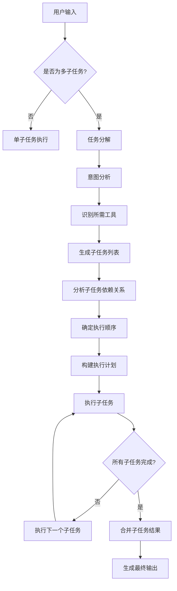

# 八爪鱼（Octopus）多子任务分解设计文档

## 文档信息

- **文档版本**: v1.0
- **创建日期**: 2026-03-27
- **作者**: 八爪鱼产品团队
- **文档类型**: 设计文档
- **适用范围**: 八爪鱼AI智能体多子任务分解与执行

---

## 1. 文档概述

本文档定义了八爪鱼AI智能体处理复杂任务时的多子任务分解与执行机制，包括：
- 多子任务分解的场景定义
- 任务分解的核心策略
- ReAct循环在任务分解中的应用
- 分层规划的实现
- 子任务依赖关系管理
- 并行执行与串行执行
- 子任务状态管理
- 错误处理和重试机制
- 实时输出与进度跟踪

本文档旨在为开发团队提供清晰的多子任务处理规范，确保八爪鱼能够高效、可靠地处理复杂任务。

---

## 2. 场景定义

### 2.1 多子任务场景

多子任务场景是指用户输入的请求无法通过单一工具调用完成，需要分解为多个子任务，按特定顺序或并行执行的复杂场景。

**典型场景示例**：

| 场景类型 | 用户输入 | 子任务分解 |
|----------|----------|------------|
| **多步骤代码生成** | "生成一个Python爬虫，爬取新闻网站并保存到数据库" | 1. 生成爬虫代码<br>2. 创建数据库表结构<br>3. 实现数据保存逻辑 |
| **数据分析流程** | "分析销售数据，生成报表并发送邮件" | 1. 读取销售数据<br>2. 数据清洗和处理<br>3. 生成可视化报表<br>4. 发送邮件 |
| **系统部署** | "部署一个Web应用到服务器" | 1. 检查服务器环境<br>2. 安装依赖<br>3. 配置应用<br>4. 启动服务<br>5. 验证部署 |
| **文档处理** | "读取PDF文档，提取关键信息并生成摘要" | 1. 读取PDF文件<br>2. 提取文本内容<br>3. 识别关键信息<br>4. 生成摘要 |

### 2.2 单子任务场景

单子任务场景是指用户输入的请求可以通过单一工具调用完成的简单场景。

**典型场景示例**：

| 场景类型 | 用户输入 | 执行方式 |
|----------|----------|----------|
| **简单代码生成** | "生成一个Python排序函数" | 直接调用代码生成工具 |
| **信息查询** | "查询北京的天气" | 直接调用天气查询工具 |
| **简单计算** | "计算1+1" | 直接调用计算工具 |
| **文本翻译** | "将'Hello'翻译成中文" | 直接调用翻译工具 |

### 2.3 场景判断机制

**判断逻辑**：
```python
def is_multi_task(user_input: str, context: dict) -> bool:
    """
    判断是否为多子任务场景
    
    判断标准：
    1. 用户输入包含多个动作动词
    2. 用户输入包含"然后"、"接着"、"之后"等连接词
    3. 用户输入包含多个不同的目标
    4. 意图分析返回多个工具需求
    5. 上下文表明需要多步骤处理
    """
    # 1. 检查多个动作动词
    action_verbs = extract_action_verbs(user_input)
    if len(action_verbs) > 1:
        return True
    
    # 2. 检查连接词
    connectors = ["然后", "接着", "之后", "并且", "同时", "再", "又"]
    if any(connector in user_input for connector in connectors):
        return True
    
    # 3. 检查多个目标
    goals = extract_goals(user_input)
    if len(goals) > 1:
        return True
    
    # 4. 检查意图分析结果
    intent_result = analyze_intent(user_input, context)
    if len(intent_result.get("required_tools", [])) > 1:
        return True
    
    # 5. 检查上下文
    if context.get("requires_multi_step", False):
        return True
    
    return False
```

---

## 3. 任务分解策略

### 3.1 核心策略

八爪鱼采用以下核心策略进行任务分解：

| 策略 | 描述 | 适用场景 |
|------|------|----------|
| **任务分解（Task Decomposition）** | 将复杂目标拆解为可执行的子任务 | 所有复杂任务 |
| **思维链（Chain of Thought, CoT）** | 引导模型展示中间推理步骤 | 需要推理的任务 |
| **分层规划（Hierarchical Planning）** | 先拆解大目标为子目标，再细化每个子目标的执行步骤 | 多环节任务 |
| **ReAct循环** | 推理+行动的循环模式 | 需要动态调整的任务 |
| **多智能体协作** | 将任务拆为多个子agent（planner agent, tool agent, verifier agent等） | 复杂协作任务 |

### 3.2 任务分解流程



### 3.3 任务分解实现

**任务分解器**：
```python
class TaskDecomposer:
    def __init__(self, model_client):
        self.model_client = model_client
    
    async def decompose(self, user_input: str, context: dict) -> dict:
        """
        分解任务为子任务
        
        Args:
            user_input: 用户输入
            context: 上下文信息
            
        Returns:
            {
                "is_multi_task": bool,
                "subtasks": [
                    {
                        "task_id": str,
                        "description": str,
                        "required_tools": List[str],
                        "dependencies": List[str],
                        "estimated_time": str,
                        "priority": int
                    }
                ],
                "execution_plan": {
                    "type": "sequential" | "parallel" | "mixed",
                    "steps": [...]
                }
            }
        """
        # 1. 意图分析
        intent_result = await self._analyze_intent(user_input, context)
        
        # 2. 判断是否为多子任务
        is_multi_task = self._is_multi_task(intent_result)
        
        if not is_multi_task:
            return {
                "is_multi_task": False,
                "subtasks": [],
                "execution_plan": None
            }
        
        # 3. 生成子任务列表
        subtasks = await self._generate_subtasks(user_input, intent_result, context)
        
        # 4. 分析依赖关系
        subtasks = self._analyze_dependencies(subtasks)
        
        # 5. 确定执行顺序
        execution_plan = self._determine_execution_order(subtasks)
        
        return {
            "is_multi_task": True,
            "subtasks": subtasks,
            "execution_plan": execution_plan
        }
    
    async def _analyze_intent(self, user_input: str, context: dict) -> dict:
        """分析用户意图"""
        request = {
            "messages": [
                {"role": "system", "content": "你是一个任务分析专家，能够分析用户输入的意图和所需的工具。"},
                {"role": "user", "content": f"分析以下用户输入的意图：{user_input}"}
            ],
            "tools": [
                {
                    "type": "function",
                    "function": {
                        "name": "analyze_intent",
                        "description": "分析用户意图",
                        "parameters": {
                            "type": "object",
                            "properties": {
                                "intent": {"type": "string", "description": "主要意图"},
                                "required_tools": {"type": "array", "items": {"type": "string"}, "description": "所需的工具列表"},
                                "complexity": {"type": "string", "enum": ["simple", "medium", "complex"], "description": "任务复杂度"}
                            },
                            "required": ["intent", "required_tools", "complexity"]
                        }
                    }
                }
            ]
        }
        
        response = await self.model_client.chat_completion(request)
        return response.get("function_call", {}).get("arguments", {})
    
    def _is_multi_task(self, intent_result: dict) -> bool:
        """判断是否为多子任务"""
        required_tools = intent_result.get("required_tools", [])
        complexity = intent_result.get("complexity", "simple")
        
        # 如果需要多个工具或复杂度为complex，则认为是多子任务
        return len(required_tools) > 1 or complexity == "complex"
    
    async def _generate_subtasks(self, user_input: str, intent_result: dict, context: dict) -> List[dict]:
        """生成子任务列表"""
        request = {
            "messages": [
                {"role": "system", "content": "你是一个任务分解专家，能够将复杂任务分解为可执行的子任务。"},
                {"role": "user", "content": f"将以下任务分解为子任务：{user_input}\n所需工具：{intent_result.get('required_tools', [])}"}
            ],
            "tools": [
                {
                    "type": "function",
                    "function": {
                        "name": "decompose_task",
                        "description": "分解任务为子任务",
                        "parameters": {
                            "type": "object",
                            "properties": {
                                "subtasks": {
                                    "type": "array",
                                    "items": {
                                        "type": "object",
                                        "properties": {
                                            "description": {"type": "string", "description": "子任务描述"},
                                            "required_tools": {"type": "array", "items": {"type": "string"}, "description": "所需的工具"},
                                            "estimated_time": {"type": "string", "description": "预估时间"},
                                            "priority": {"type": "integer", "description": "优先级（1-10）"}
                                        },
                                        "required": ["description", "required_tools", "estimated_time", "priority"]
                                    }
                                }
                            },
                            "required": ["subtasks"]
                        }
                    }
                }
            ]
        }
        
        response = await self.model_client.chat_completion(request)
        subtasks_data = response.get("function_call", {}).get("arguments", {}).get("subtasks", [])
        
        # 为每个子任务生成唯一ID
        subtasks = []
        for i, task_data in enumerate(subtasks_data):
            subtasks.append({
                "task_id": f"task_{i+1}",
                "description": task_data.get("description"),
                "required_tools": task_data.get("required_tools", []),
                "dependencies": [],
                "estimated_time": task_data.get("estimated_time"),
                "priority": task_data.get("priority", 5),
                "status": "pending"
            })
        
        return subtasks
    
    def _analyze_dependencies(self, subtasks: List[dict]) -> List[dict]:
        """分析子任务之间的依赖关系"""
        # 简单实现：根据工具的输入输出关系分析依赖
        # 实际实现可能需要更复杂的逻辑
        for i, task in enumerate(subtasks):
            if i > 0:
                # 默认依赖前一个任务
                task["dependencies"] = [subtasks[i-1]["task_id"]]
        
        return subtasks
    
    def _determine_execution_order(self, subtasks: List[dict]) -> dict:
        """确定执行顺序"""
        # 检查是否有并行执行的可能
        has_parallel = self._can_execute_parallel(subtasks)
        
        if has_parallel:
            return {
                "type": "mixed",
                "steps": self._build_mixed_execution_plan(subtasks)
            }
        else:
            return {
                "type": "sequential",
                "steps": [{"task_id": task["task_id"], "order": i} for i, task in enumerate(subtasks)]
            }
    
    def _can_execute_parallel(self, subtasks: List[dict]) -> bool:
        """判断是否可以并行执行"""
        # 检查是否有无依赖关系的子任务
        for i, task1 in enumerate(subtasks):
            for j, task2 in enumerate(subtasks):
                if i < j:
                    # 如果task2不依赖task1，且task1不依赖task2，则可以并行
                    if (task2["task_id"] not in task1["dependencies"] and 
                        task1["task_id"] not in task2["dependencies"]):
                        return True
        return False
    
    def _build_mixed_execution_plan(self, subtasks: List[dict]) -> List[dict]:
        """构建混合执行计划（串行+并行）"""
        # 简化实现：先串行执行有依赖的任务，再并行执行无依赖的任务
        plan = []
        executed_tasks = set()
        
        # 第一阶段：串行执行有依赖的任务
        for task in subtasks:
            if task["dependencies"]:
                plan.append({"task_id": task["task_id"], "order": len(plan), "type": "sequential"})
                executed_tasks.add(task["task_id"])
        
        # 第二阶段：并行执行无依赖的任务
        parallel_tasks = [task for task in subtasks if not task["dependencies"]]
        if parallel_tasks:
            plan.append({
                "task_ids": [task["task_id"] for task in parallel_tasks],
                "order": len(plan),
                "type": "parallel"
            })
        
        return plan
```

---

## 4. ReAct循环在任务分解中的应用

### 4.1 ReAct架构概述

ReAct（Reasoning + Acting）是一种结合推理和行动的架构模式，通过循环执行以下步骤来完成任务：

1. **Thought（思考）**：分析当前状态，确定下一步行动
2. **Action（行动）**：执行具体的工具调用
3. **Observation（观察）**：观察行动结果
4. **Repeat（重复）**：重复上述步骤直到任务完成

### 4.2 ReAct循环实现

```python
class ReActExecutor:
    def __init__(self, model_client, tool_registry):
        self.model_client = model_client
        self.tool_registry = tool_registry
    
    async def execute(self, user_input: str, context: dict) -> dict:
        """
        使用ReAct循环执行任务
        
        Args:
            user_input: 用户输入
            context: 上下文信息
            
        Returns:
            执行结果
        """
        # 初始化状态
        state = {
            "user_input": user_input,
            "context": context,
            "thoughts": [],
            "actions": [],
            "observations": [],
            "current_step": 0,
            "max_steps": 10,
            "completed": False
        }
        
        # ReAct循环
        while not state["completed"] and state["current_step"] < state["max_steps"]:
            # 1. 思考
            thought = await self._think(state)
            state["thoughts"].append(thought)
            
            # 2. 行动
            action = await self._act(thought, state)
            state["actions"].append(action)
            
            # 3. 观察
            observation = await self._observe(action, state)
            state["observations"].append(observation)
            
            # 4. 判断是否完成
            state["completed"] = self._is_completed(observation)
            
            # 5. 更新状态
            state["current_step"] += 1
        
        # 生成最终结果
        return self._generate_result(state)
    
    async def _think(self, state: dict) -> str:
        """思考下一步行动"""
        request = {
            "messages": [
                {"role": "system", "content": "你是一个任务执行专家，能够分析当前状态并确定下一步行动。"},
                {"role": "user", "content": self._build_thought_prompt(state)}
            ],
            "tools": [
                {
                    "type": "function",
                    "function": {
                        "name": "think",
                        "description": "思考下一步行动",
                        "parameters": {
                            "type": "object",
                            "properties": {
                                "thought": {"type": "string", "description": "思考内容"},
                                "next_action": {"type": "string", "description": "下一步行动"},
                                "reasoning": {"type": "string", "description": "推理过程"}
                            },
                            "required": ["thought", "next_action", "reasoning"]
                        }
                    }
                }
            ]
        }
        
        response = await self.model_client.chat_completion(request)
        return response.get("function_call", {}).get("arguments", {})
    
    async def _act(self, thought: dict, state: dict) -> dict:
        """执行行动"""
        next_action = thought.get("next_action")
        
        # 解析行动
        action = self._parse_action(next_action)
        
        # 执行工具
        if action["type"] == "tool_call":
            tool = self.tool_registry.get_tool(action["tool_name"])
            result = await tool.execute(action["parameters"])
            return {
                "type": "tool_call",
                "tool_name": action["tool_name"],
                "parameters": action["parameters"],
                "result": result
            }
        elif action["type"] == "subtask":
            # 执行子任务
            result = await self._execute_subtask(action["subtask_id"], state)
            return {
                "type": "subtask",
                "subtask_id": action["subtask_id"],
                "result": result
            }
        else:
            raise ValueError(f"Unknown action type: {action['type']}")
    
    async def _observe(self, action: dict, state: dict) -> str:
        """观察行动结果"""
        request = {
            "messages": [
                {"role": "system", "content": "你是一个任务观察专家，能够分析行动结果并判断任务是否完成。"},
                {"role": "user", "content": self._build_observation_prompt(action, state)}
            ],
            "tools": [
                {
                    "type": "function",
                    "function": {
                        "name": "observe",
                        "description": "观察行动结果",
                        "parameters": {
                            "type": "object",
                            "properties": {
                                "observation": {"type": "string", "description": "观察结果"},
                                "is_completed": {"type": "boolean", "description": "任务是否完成"},
                                "next_step": {"type": "string", "description": "下一步建议"}
                            },
                            "required": ["observation", "is_completed", "next_step"]
                        }
                    }
                }
            ]
        }
        
        response = await self.model_client.chat_completion(request)
        return response.get("function_call", {}).get("arguments", {})
    
    def _is_completed(self, observation: dict) -> bool:
        """判断任务是否完成"""
        return observation.get("is_completed", False)
    
    def _generate_result(self, state: dict) -> dict:
        """生成最终结果"""
        return {
            "user_input": state["user_input"],
            "thoughts": state["thoughts"],
            "actions": state["actions"],
            "observations": state["observations"],
            "completed": state["completed"],
            "steps": state["current_step"]
        }
    
    def _build_thought_prompt(self, state: dict) -> str:
        """构建思考提示"""
        prompt = f"用户输入：{state['user_input']}\n\n"
        
        if state["thoughts"]:
            prompt += "之前的思考：\n"
            for i, thought in enumerate(state["thoughts"]):
                prompt += f"{i+1}. {thought}\n"
        
        if state["actions"]:
            prompt += "\n之前的行动：\n"
            for i, action in enumerate(state["actions"]):
                prompt += f"{i+1}. {action}\n"
        
        if state["observations"]:
            prompt += "\n之前的观察：\n"
            for i, observation in enumerate(state["observations"]):
                prompt += f"{i+1}. {observation}\n"
        
        prompt += f"\n当前步骤：{state['current_step']}/{state['max_steps']}\n"
        prompt += "\n请分析当前状态，确定下一步行动。"
        
        return prompt
    
    def _build_observation_prompt(self, action: dict, state: dict) -> str:
        """构建观察提示"""
        prompt = f"行动：{action}\n\n"
        prompt += "请分析行动结果，判断任务是否完成。"
        
        return prompt
    
    def _parse_action(self, next_action: str) -> dict:
        """解析行动"""
        # 简化实现：实际需要更复杂的解析逻辑
        if "tool:" in next_action:
            parts = next_action.split("tool:")
            tool_name = parts[1].strip()
            return {
                "type": "tool_call",
                "tool_name": tool_name,
                "parameters": {}
            }
        elif "subtask:" in next_action:
            parts = next_action.split("subtask:")
            subtask_id = parts[1].strip()
            return {
                "type": "subtask",
                "subtask_id": subtask_id
            }
        else:
            raise ValueError(f"Cannot parse action: {next_action}")
    
    async def _execute_subtask(self, subtask_id: str, state: dict) -> dict:
        """执行子任务"""
        # 简化实现：实际需要从子任务列表中获取子任务并执行
        return {"subtask_id": subtask_id, "status": "completed"}
```

---

## 5. 分层规划实现

### 5.1 分层规划概述

分层规划（Hierarchical Planning）是一种将任务分解为多个层次的规划方法：

1. **高层目标**：定义整体目标和主要阶段
2. **中层目标**：将高层目标分解为子目标
3. **低层行动**：将中层目标分解为具体的可执行步骤

### 5.2 分层规划实现

```python
class HierarchicalPlanner:
    def __init__(self, model_client):
        self.model_client = model_client
    
    async def plan(self, user_input: str, context: dict) -> dict:
        """
        生成分层规划
        
        Args:
            user_input: 用户输入
            context: 上下文信息
            
        Returns:
            {
                "high_level_goals": [...],
                "mid_level_goals": [...],
                "low_level_actions": [...]
            }
        """
        # 1. 生成高层目标
        high_level_goals = await self._generate_high_level_goals(user_input, context)
        
        # 2. 生成中层目标
        mid_level_goals = await self._generate_mid_level_goals(high_level_goals, context)
        
        # 3. 生成低层行动
        low_level_actions = await self._generate_low_level_actions(mid_level_goals, context)
        
        return {
            "high_level_goals": high_level_goals,
            "mid_level_goals": mid_level_goals,
            "low_level_actions": low_level_actions
        }
    
    async def _generate_high_level_goals(self, user_input: str, context: dict) -> List[dict]:
        """生成高层目标"""
        request = {
            "messages": [
                {"role": "system", "content": "你是一个高层规划专家，能够将复杂任务分解为高层目标。"},
                {"role": "user", "content": f"将以下任务分解为高层目标：{user_input}"}
            ],
            "tools": [
                {
                    "type": "function",
                    "function": {
                        "name": "generate_high_level_goals",
                        "description": "生成高层目标",
                        "parameters": {
                            "type": "object",
                            "properties": {
                                "goals": {
                                    "type": "array",
                                    "items": {
                                        "type": "object",
                                        "properties": {
                                            "goal_id": {"type": "string", "description": "目标ID"},
                                            "description": {"type": "string", "description": "目标描述"},
                                            "priority": {"type": "integer", "description": "优先级"}
                                        },
                                        "required": ["goal_id", "description", "priority"]
                                    }
                                }
                            },
                            "required": ["goals"]
                        }
                    }
                }
            ]
        }
        
        response = await self.model_client.chat_completion(request)
        return response.get("function_call", {}).get("arguments", {}).get("goals", [])
    
    async def _generate_mid_level_goals(self, high_level_goals: List[dict], context: dict) -> List[dict]:
        """生成中层目标"""
        mid_level_goals = []
        
        for high_goal in high_level_goals:
            request = {
                "messages": [
                    {"role": "system", "content": "你是一个中层规划专家，能够将高层目标分解为中层目标。"},
                    {"role": "user", "content": f"将以下高层目标分解为中层目标：{high_goal['description']}"}
                ],
                "tools": [
                    {
                        "type": "function",
                        "function": {
                            "name": "generate_mid_level_goals",
                            "description": "生成中层目标",
                            "parameters": {
                                "type": "object",
                                "properties": {
                                    "goals": {
                                        "type": "array",
                                        "items": {
                                            "type": "object",
                                            "properties": {
                                                "goal_id": {"type": "string", "description": "目标ID"},
                                                "description": {"type": "string", "description": "目标描述"},
                                                "parent_goal_id": {"type": "string", "description": "父目标ID"},
                                                "priority": {"type": "integer", "description": "优先级"}
                                            },
                                            "required": ["goal_id", "description", "parent_goal_id", "priority"]
                                        }
                                    }
                                },
                                "required": ["goals"]
                            }
                        }
                    }
                ]
            }
            
            response = await self.model_client.chat_completion(request)
            goals = response.get("function_call", {}).get("arguments", {}).get("goals", [])
            mid_level_goals.extend(goals)
        
        return mid_level_goals
    
    async def _generate_low_level_actions(self, mid_level_goals: List[dict], context: dict) -> List[dict]:
        """生成低层行动"""
        low_level_actions = []
        
        for mid_goal in mid_level_goals:
            request = {
                "messages": [
                    {"role": "system", "content": "你是一个低层规划专家，能够将中层目标分解为具体的可执行行动。"},
                    {"role": "user", "content": f"将以下中层目标分解为具体的可执行行动：{mid_goal['description']}"}
                ],
                "tools": [
                    {
                        "type": "function",
                        "function": {
                            "name": "generate_low_level_actions",
                            "description": "生成低层行动",
                            "parameters": {
                                "type": "object",
                                "properties": {
                                    "actions": {
                                        "type": "array",
                                        "items": {
                                            "type": "object",
                                            "properties": {
                                                "action_id": {"type": "string", "description": "行动ID"},
                                                "description": {"type": "string", "description": "行动描述"},
                                                "tool_name": {"type": "string", "description": "所需的工具"},
                                                "parameters": {"type": "object", "description": "工具参数"},
                                                "parent_goal_id": {"type": "string", "description": "父目标ID"}
                                            },
                                            "required": ["action_id", "description", "tool_name", "parameters", "parent_goal_id"]
                                        }
                                    }
                                },
                                "required": ["actions"]
                            }
                        }
                    }
                ]
            }
            
            response = await self.model_client.chat_completion(request)
            actions = response.get("function_call", {}).get("arguments", {}).get("actions", [])
            low_level_actions.extend(actions)
        
        return low_level_actions
```

---

## 6. 子任务依赖关系管理

### 6.1 依赖关系类型

| 依赖类型 | 描述 | 示例 |
|----------|------|------|
| **顺序依赖** | 子任务B必须在子任务A完成后才能开始 | 子任务A：读取数据<br>子任务B：处理数据 |
| **并行独立** | 子任务A和子任务B可以同时执行 | 子任务A：生成代码<br>子任务B：生成文档 |
| **数据依赖** | 子任务B需要子任务A的输出作为输入 | 子任务A：爬取数据<br>子任务B：分析数据 |
| **条件依赖** | 子任务B的执行取决于子任务A的结果 | 子任务A：检查环境<br>子任务B：安装依赖（如果环境不满足） |

### 6.2 依赖关系管理实现

```python
class DependencyManager:
    def __init__(self):
        self.task_graph = {}
    
    def add_task(self, task_id: str, dependencies: List[str] = None):
        """
        添加任务及其依赖关系
        
        Args:
            task_id: 任务ID
            dependencies: 依赖的任务ID列表
        """
        if dependencies is None:
            dependencies = []
        
        self.task_graph[task_id] = {
            "dependencies": dependencies,
            "dependents": []
        }
        
        # 更新依赖任务的dependents
        for dep_id in dependencies:
            if dep_id in self.task_graph:
                self.task_graph[dep_id]["dependents"].append(task_id)
    
    def can_execute(self, task_id: str, completed_tasks: set) -> bool:
        """
        判断任务是否可以执行
        
        Args:
            task_id: 任务ID
            completed_tasks: 已完成的任务集合
            
        Returns:
            是否可以执行
        """
        if task_id not in self.task_graph:
            return False
        
        dependencies = self.task_graph[task_id]["dependencies"]
        return all(dep_id in completed_tasks for dep_id in dependencies)
    
    def get_ready_tasks(self, completed_tasks: set) -> List[str]:
        """
        获取可以执行的任务列表
        
        Args:
            completed_tasks: 已完成的任务集合
            
        Returns:
            可以执行的任务ID列表
        """
        ready_tasks = []
        
        for task_id in self.task_graph:
            if self.can_execute(task_id, completed_tasks) and task_id not in completed_tasks:
                ready_tasks.append(task_id)
        
        return ready_tasks
    
    def get_execution_order(self) -> List[List[str]]:
        """
        获取执行顺序（按层级分组）
        
        Returns:
            每一层可以并行执行的任务ID列表
        """
        execution_order = []
        completed_tasks = set()
        
        while len(completed_tasks) < len(self.task_graph):
            # 获取可以执行的任务
            ready_tasks = self.get_ready_tasks(completed_tasks)
            
            if not ready_tasks:
                # 没有可以执行的任务，说明有循环依赖
                raise ValueError("Circular dependency detected")
            
            execution_order.append(ready_tasks)
            completed_tasks.update(ready_tasks)
        
        return execution_order
    
    def visualize(self) -> str:
        """
        可视化任务依赖关系
        
        Returns:
            Mermaid格式的依赖关系图
        """
        lines = ["graph TD"]
        
        for task_id, task_info in self.task_graph.items():
            for dep_id in task_info["dependencies"]:
                lines.append(f"    {dep_id} --> {task_id}")
        
        return "\n".join(lines)
```

---

## 7. 并行执行与串行执行

### 7.1 执行模式

| 执行模式 | 描述 | 适用场景 |
|----------|------|----------|
| **串行执行** | 按顺序一个接一个执行子任务 | 有依赖关系的子任务 |
| **并行执行** | 同时执行多个子任务 | 无依赖关系的子任务 |
| **混合执行** | 串行和并行混合执行 | 部分子任务有依赖，部分无依赖 |

### 7.2 执行器实现

```python
class TaskExecutor:
    def __init__(self, tool_registry, realtime_service):
        self.tool_registry = tool_registry
        self.realtime_service = realtime_service
        self.dependency_manager = DependencyManager()
    
    async def execute(self, subtasks: List[dict], execution_plan: dict, session_id: str) -> dict:
        """
        执行子任务
        
        Args:
            subtasks: 子任务列表
            execution_plan: 执行计划
            session_id: 会话ID
            
        Returns:
            执行结果
        """
        # 构建依赖关系图
        for task in subtasks:
            self.dependency_manager.add_task(task["task_id"], task.get("dependencies", []))
        
        # 根据执行计划执行
        if execution_plan["type"] == "sequential":
            return await self._execute_sequential(subtasks, session_id)
        elif execution_plan["type"] == "parallel":
            return await self._execute_parallel(subtasks, session_id)
        elif execution_plan["type"] == "mixed":
            return await self._execute_mixed(subtasks, execution_plan["steps"], session_id)
        else:
            raise ValueError(f"Unknown execution plan type: {execution_plan['type']}")
    
    async def _execute_sequential(self, subtasks: List[dict], session_id: str) -> dict:
        """串行执行子任务"""
        results = {}
        completed_tasks = set()
        
        for task in subtasks:
            # 推送任务开始事件
            await self.realtime_service.push_event(session_id, {
                "event_type": "task_started",
                "timestamp": datetime.now().isoformat(),
                "session_id": session_id,
                "data": {
                    "task_id": task["task_id"],
                    "description": task["description"],
                    "status": "started"
                }
            })
            
            # 执行任务
            result = await self._execute_single_task(task, session_id)
            results[task["task_id"]] = result
            completed_tasks.add(task["task_id"])
            
            # 推送任务完成事件
            await self.realtime_service.push_event(session_id, {
                "event_type": "task_completed",
                "timestamp": datetime.now().isoformat(),
                "session_id": session_id,
                "data": {
                    "task_id": task["task_id"],
                    "description": task["description"],
                    "status": "completed",
                    "result": result
                }
            })
        
        return {"results": results, "completed_tasks": list(completed_tasks)}
    
    async def _execute_parallel(self, subtasks: List[dict], session_id: str) -> dict:
        """并行执行子任务"""
        results = {}
        completed_tasks = set()
        
        # 创建所有任务的协程
        tasks = [self._execute_single_task(task, session_id) for task in subtasks]
        
        # 推送任务开始事件
        for task in subtasks:
            await self.realtime_service.push_event(session_id, {
                "event_type": "task_started",
                "timestamp": datetime.now().isoformat(),
                "session_id": session_id,
                "data": {
                    "task_id": task["task_id"],
                    "description": task["description"],
                    "status": "started"
                }
            })
        
        # 并行执行所有任务
        task_results = await asyncio.gather(*tasks, return_exceptions=True)
        
        # 处理结果
        for task, result in zip(subtasks, task_results):
            if isinstance(result, Exception):
                results[task["task_id"]] = {"error": str(result)}
            else:
                results[task["task_id"]] = result
            completed_tasks.add(task["task_id"])
            
            # 推送任务完成事件
            await self.realtime_service.push_event(session_id, {
                "event_type": "task_completed",
                "timestamp": datetime.now().isoformat(),
                "session_id": session_id,
                "data": {
                    "task_id": task["task_id"],
                    "description": task["description"],
                    "status": "completed",
                    "result": results[task["task_id"]]
                }
            })
        
        return {"results": results, "completed_tasks": list(completed_tasks)}
    
    async def _execute_mixed(self, subtasks: List[dict], steps: List[dict], session_id: str) -> dict:
        """混合执行子任务（串行+并行）"""
        results = {}
        completed_tasks = set()
        
        # 构建任务ID到任务的映射
        task_map = {task["task_id"]: task for task in subtasks}
        
        # 按步骤执行
        for step in steps:
            if step["type"] == "sequential":
                # 串行执行
                task = task_map[step["task_id"]]
                result = await self._execute_single_task(task, session_id)
                results[task["task_id"]] = result
                completed_tasks.add(task["task_id"])
                
                # 推送任务完成事件
                await self.realtime_service.push_event(session_id, {
                    "event_type": "task_completed",
                    "timestamp": datetime.now().isoformat(),
                    "session_id": session_id,
                    "data": {
                        "task_id": task["task_id"],
                        "description": task["description"],
                        "status": "completed",
                        "result": result
                    }
                })
            elif step["type"] == "parallel":
                # 并行执行
                tasks = [task_map[task_id] for task_id in step["task_ids"]]
                
                # 推送任务开始事件
                for task in tasks:
                    await self.realtime_service.push_event(session_id, {
                        "event_type": "task_started",
                        "timestamp": datetime.now().isoformat(),
                        "session_id": session_id,
                        "data": {
                            "task_id": task["task_id"],
                            "description": task["description"],
                            "status": "started"
                        }
                    })
                
                # 并行执行
                task_results = await asyncio.gather(
                    *[self._execute_single_task(task, session_id) for task in tasks],
                    return_exceptions=True
                )
                
                # 处理结果
                for task, result in zip(tasks, task_results):
                    if isinstance(result, Exception):
                        results[task["task_id"]] = {"error": str(result)}
                    else:
                        results[task["task_id"]] = result
                    completed_tasks.add(task["task_id"])
                    
                    # 推送任务完成事件
                    await self.realtime_service.push_event(session_id, {
                        "event_type": "task_completed",
                        "timestamp": datetime.now().isoformat(),
                        "session_id": session_id,
                        "data": {
                            "task_id": task["task_id"],
                            "description": task["description"],
                            "status": "completed",
                            "result": results[task["task_id"]]
                        }
                    })
        
        return {"results": results, "completed_tasks": list(completed_tasks)}
    
    async def _execute_single_task(self, task: dict, session_id: str) -> dict:
        """执行单个任务"""
        # 获取任务所需的工具
        tool_names = task.get("required_tools", [])
        
        # 执行每个工具
        results = []
        for tool_name in tool_names:
            tool = self.tool_registry.get_tool(tool_name)
            result = await tool.execute(task.get("parameters", {}))
            results.append({
                "tool_name": tool_name,
                "result": result
            })
        
        return {"task_id": task["task_id"], "results": results}
```

---

## 8. 子任务状态管理

### 8.1 状态定义

| 状态 | 描述 | 触发条件 |
|------|------|----------|
| **pending** | 等待执行 | 任务创建后 |
| **ready** | 准备执行 | 所有依赖任务完成 |
| **running** | 正在执行 | 任务开始执行 |
| **completed** | 执行完成 | 任务成功完成 |
| **failed** | 执行失败 | 任务执行出错 |
| **cancelled** | 已取消 | 用户取消任务 |
| **retrying** | 正在重试 | 任务失败后重试 |

### 8.2 状态管理实现

```python
class TaskStateManager:
    def __init__(self):
        self.task_states = {}
        self.state_history = {}
    
    def create_task(self, task_id: str, task_info: dict):
        """
        创建任务
        
        Args:
            task_id: 任务ID
            task_info: 任务信息
        """
        self.task_states[task_id] = {
            "task_id": task_id,
            "task_info": task_info,
            "status": "pending",
            "start_time": None,
            "end_time": None,
            "error": None,
            "retry_count": 0,
            "max_retries": 3
        }
        self.state_history[task_id] = [
            {
                "status": "pending",
                "timestamp": datetime.now().isoformat()
            }
        ]
    
    def update_status(self, task_id: str, status: str, error: str = None):
        """
        更新任务状态
        
        Args:
            task_id: 任务ID
            status: 新状态
            error: 错误信息（如果有）
        """
        if task_id not in self.task_states:
            raise ValueError(f"Task {task_id} not found")
        
        self.task_states[task_id]["status"] = status
        self.task_states[task_id]["error"] = error
        
        if status == "running" and self.task_states[task_id]["start_time"] is None:
            self.task_states[task_id]["start_time"] = datetime.now().isoformat()
        
        if status in ["completed", "failed", "cancelled"]:
            self.task_states[task_id]["end_time"] = datetime.now().isoformat()
        
        # 记录状态历史
        self.state_history[task_id].append({
            "status": status,
            "timestamp": datetime.now().isoformat(),
            "error": error
        })
    
    def get_status(self, task_id: str) -> str:
        """
        获取任务状态
        
        Args:
            task_id: 任务ID
            
        Returns:
            任务状态
        """
        if task_id not in self.task_states:
            raise ValueError(f"Task {task_id} not found")
        
        return self.task_states[task_id]["status"]
    
    def get_task_info(self, task_id: str) -> dict:
        """
        获取任务信息
        
        Args:
            task_id: 任务ID
            
        Returns:
            任务信息
        """
        if task_id not in self.task_states:
            raise ValueError(f"Task {task_id} not found")
        
        return self.task_states[task_id]
    
    def get_state_history(self, task_id: str) -> List[dict]:
        """
        获取状态历史
        
        Args:
            task_id: 任务ID
            
        Returns:
            状态历史
        """
        if task_id not in self.state_history:
            raise ValueError(f"Task {task_id} not found")
        
        return self.state_history[task_id]
    
    def can_retry(self, task_id: str) -> bool:
        """
        判断任务是否可以重试
        
        Args:
            task_id: 任务ID
            
        Returns:
            是否可以重试
        """
        if task_id not in self.task_states:
            return False
        
        task = self.task_states[task_id]
        return (task["status"] == "failed" and 
                task["retry_count"] < task["max_retries"])
    
    def increment_retry(self, task_id: str):
        """
        增加重试次数
        
        Args:
            task_id: 任务ID
        """
        if task_id not in self.task_states:
            raise ValueError(f"Task {task_id} not found")
        
        self.task_states[task_id]["retry_count"] += 1
        self.update_status(task_id, "retrying")
    
    def get_all_tasks(self) -> List[dict]:
        """
        获取所有任务
        
        Returns:
            所有任务列表
        """
        return list(self.task_states.values())
    
    def get_tasks_by_status(self, status: str) -> List[dict]:
        """
        按状态获取任务
        
        Args:
            status: 任务状态
            
        Returns:
            任务列表
        """
        return [task for task in self.task_states.values() if task["status"] == status]
```

---

## 9. 错误处理和重试机制

### 9.1 错误类型

| 错误类型 | 描述 | 处理方式 |
|----------|------|----------|
| **工具执行错误** | 工具执行失败 | 重试或跳过 |
| **参数错误** | 工具参数错误 | 重新生成参数 |
| **依赖错误** | 依赖任务失败 | 等待依赖任务重试或跳过 |
| **超时错误** | 任务执行超时 | 重试或取消 |
| **权限错误** | 权限不足 | 提示用户并提供解决方案 |

### 9.2 错误处理实现

```python
class ErrorHandler:
    def __init__(self, task_state_manager, realtime_service):
        self.task_state_manager = task_state_manager
        self.realtime_service = realtime_service
    
    async def handle_error(self, task_id: str, error: Exception, session_id: str):
        """
        处理错误
        
        Args:
            task_id: 任务ID
            error: 错误对象
            session_id: 会话ID
        """
        # 更新任务状态
        self.task_state_manager.update_status(task_id, "failed", str(error))
        
        # 判断是否可以重试
        if self.task_state_manager.can_retry(task_id):
            # 重试任务
            await self._retry_task(task_id, session_id)
        else:
            # 任务失败
            await self._notify_task_failed(task_id, error, session_id)
    
    async def _retry_task(self, task_id: str, session_id: str):
        """
        重试任务
        
        Args:
            task_id: 任务ID
            session_id: 会话ID
        """
        # 增加重试次数
        self.task_state_manager.increment_retry(task_id)
        
        # 推送重试事件
        await self.realtime_service.push_event(session_id, {
            "event_type": "task_retrying",
            "timestamp": datetime.now().isoformat(),
            "session_id": session_id,
            "data": {
                "task_id": task_id,
                "retry_count": self.task_state_manager.get_task_info(task_id)["retry_count"],
                "max_retries": self.task_state_manager.get_task_info(task_id)["max_retries"]
            }
        })
    
    async def _notify_task_failed(self, task_id: str, error: Exception, session_id: str):
        """
        通知任务失败
        
        Args:
            task_id: 任务ID
            error: 错误对象
            session_id: 会话ID
        """
        task_info = self.task_state_manager.get_task_info(task_id)
        
        # 推送任务失败事件
        await self.realtime_service.push_event(session_id, {
            "event_type": "task_failed",
            "timestamp": datetime.now().isoformat(),
            "session_id": session_id,
            "data": {
                "task_id": task_id,
                "description": task_info["task_info"]["description"],
                "error": str(error),
                "retry_count": task_info["retry_count"],
                "max_retries": task_info["max_retries"]
            }
        })
```

---

## 10. 实时输出与进度跟踪

### 10.1 进度计算

```python
class ProgressTracker:
    def __init__(self, task_state_manager):
        self.task_state_manager = task_state_manager
    
    def calculate_progress(self, task_ids: List[str]) -> float:
        """
        计算总体进度
        
        Args:
            task_ids: 任务ID列表
            
        Returns:
            进度百分比（0-100）
        """
        if not task_ids:
            return 0.0
        
        total_tasks = len(task_ids)
        completed_tasks = 0
        
        for task_id in task_ids:
            status = self.task_state_manager.get_status(task_id)
            if status == "completed":
                completed_tasks += 1
        
        return (completed_tasks / total_tasks) * 100
    
    def get_progress_details(self, task_ids: List[str]) -> dict:
        """
        获取进度详情
        
        Args:
            task_ids: 任务ID列表
            
        Returns:
            进度详情
        """
        details = {
            "total": len(task_ids),
            "completed": 0,
            "running": 0,
            "failed": 0,
            "pending": 0,
            "progress": 0.0
        }
        
        for task_id in task_ids:
            status = self.task_state_manager.get_status(task_id)
            details[status] += 1
        
        details["progress"] = (details["completed"] / details["total"]) * 100
        
        return details
```

### 10.2 实时输出事件

| 事件类型 | 描述 | 数据格式 |
|----------|------|----------|
| `task_decomposition_started` | 任务分解开始 | {"task_count": int} |
| `task_decomposition_completed` | 任务分解完成 | {"subtasks": [...]} |
| `task_started` | 任务开始 | {"task_id": str, "description": str} |
| `task_completed` | 任务完成 | {"task_id": str, "result": {...}} |
| `task_failed` | 任务失败 | {"task_id": str, "error": str} |
| `task_retrying` | 任务重试 | {"task_id": str, "retry_count": int} |
| `progress_updated` | 进度更新 | {"progress": float, "details": {...}} |

---

## 11. 完整示例

### 11.1 示例场景

**用户输入**：
"生成一个Python爬虫，爬取新闻网站并保存到数据库"

### 11.2 任务分解

```python
# 任务分解结果
{
    "is_multi_task": True,
    "subtasks": [
        {
            "task_id": "task_1",
            "description": "生成Python爬虫代码",
            "required_tools": ["code_generator"],
            "dependencies": [],
            "estimated_time": "30s",
            "priority": 1
        },
        {
            "task_id": "task_2",
            "description": "创建数据库表结构",
            "required_tools": ["database_manager"],
            "dependencies": [],
            "estimated_time": "10s",
            "priority": 2
        },
        {
            "task_id": "task_3",
            "description": "实现数据保存逻辑",
            "required_tools": ["code_generator"],
            "dependencies": ["task_1", "task_2"],
            "estimated_time": "20s",
            "priority": 3
        }
    ],
    "execution_plan": {
        "type": "mixed",
        "steps": [
            {
                "task_ids": ["task_1", "task_2"],
                "order": 0,
                "type": "parallel"
            },
            {
                "task_id": "task_3",
                "order": 1,
                "type": "sequential"
            }
        ]
    }
}
```

### 11.3 执行流程

```python
# 执行流程
async def execute_example():
    # 1. 任务分解
    decomposer = TaskDecomposer(model_client)
    decomposition_result = await decomposer.decompose(user_input, context)
    
    # 推送任务分解完成事件
    await realtime_service.push_event(session_id, {
        "event_type": "task_decomposition_completed",
        "timestamp": datetime.now().isoformat(),
        "session_id": session_id,
        "data": {
            "subtasks": decomposition_result["subtasks"],
            "execution_plan": decomposition_result["execution_plan"]
        }
    })
    
    # 2. 执行子任务
    executor = TaskExecutor(tool_registry, realtime_service)
    execution_result = await executor.execute(
        decomposition_result["subtasks"],
        decomposition_result["execution_plan"],
        session_id
    )
    
    # 3. 生成最终结果
    final_result = {
        "user_input": user_input,
        "subtasks": decomposition_result["subtasks"],
        "execution_result": execution_result,
        "completed": True
    }
    
    # 推送任务完成事件
    await realtime_service.push_event(session_id, {
        "event_type": "completed",
        "timestamp": datetime.now().isoformat(),
        "session_id": session_id,
        "data": {
            "message": "所有子任务已完成",
            "result": final_result
        }
    })
    
    return final_result
```

---

## 12. 结论与建议

### 12.1 核心结论

1. **任务分解是处理复杂任务的关键**：通过将复杂任务分解为可执行的子任务，八爪鱼能够高效地处理各种复杂场景。

2. **多种策略组合使用**：任务分解、思维链、分层规划、ReAct循环等策略的组合使用，能够提高任务分解的准确性和执行效率。

3. **依赖关系管理至关重要**：通过依赖关系管理，可以确保子任务按照正确的顺序执行，避免执行错误。

4. **并行执行提高效率**：对于无依赖关系的子任务，并行执行可以显著提高执行效率。

5. **实时输出提升用户体验**：通过实时输出子任务的执行状态和进度，用户可以清楚地了解任务的执行情况。

### 12.2 实施建议

1. **分阶段实施**：
   - 第一阶段：实现基本的任务分解和串行执行
   - 第二阶段：实现并行执行和依赖关系管理
   - 第三阶段：实现错误处理和重试机制
   - 第四阶段：实现实时输出和进度跟踪

2. **优先级建议**：
   - 高优先级：任务分解、依赖关系管理、串行执行
   - 中优先级：并行执行、错误处理、重试机制
   - 低优先级：实时输出、进度跟踪、性能优化

3. **测试建议**：
   - 测试各种复杂度的任务分解
   - 测试不同的依赖关系场景
   - 测试错误处理和重试机制
   - 测试并行执行的性能

### 12.3 未来扩展

1. **智能任务分解**：基于历史数据和机器学习，提高任务分解的准确性。

2. **动态调整执行计划**：根据执行过程中的反馈，动态调整执行计划。

3. **多智能体协作**：将不同的子任务分配给不同的智能体，实现真正的多智能体协作。

4. **任务缓存**：缓存已执行的任务结果，避免重复执行。

5. **任务优先级调度**：基于任务优先级和资源可用性，实现智能的任务调度。

---

**文档结束**

**变更历史**:
- v1.0 (2026-03-27): 初始版本
